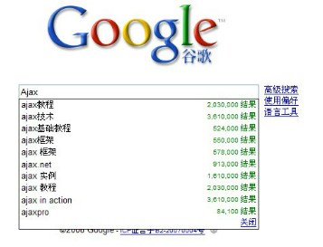
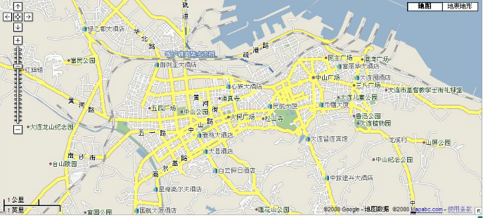
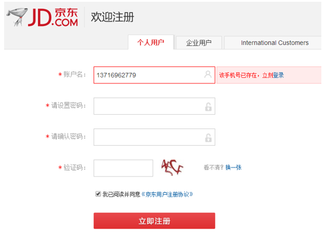
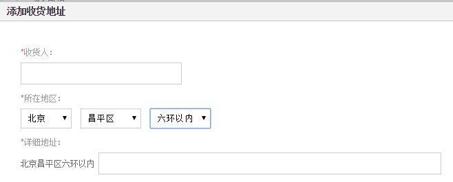
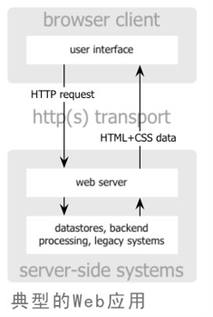
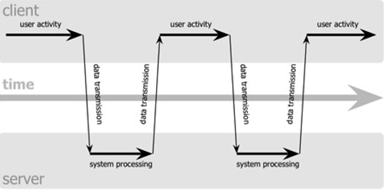
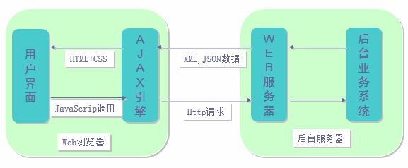
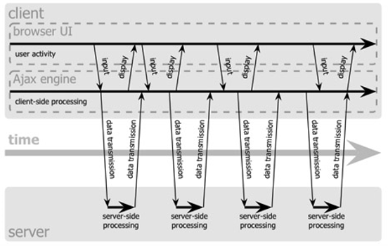

## 目录
* [Ajax简介](#a)
    * 什么是Ajax？  
    * Ajax的应用场景
    * 区别传统WEB请求与Ajax请求
* [Ajax开发过程](#b)
    * 原生API --- XMLHttpRequest对象
    * 基本步骤：
        1. 创建XMLHttpRequest对象
        2. 设置监听回调
        3. 发送请求
        4. 相关API说明
* [异步与同步Ajax请求](#c)
    * 如何设置请求的同步或异步?
    * 同步请求与异步请求的区别?
    * 异步请求
    * 同步请求
* [框架使用 Ajax (jQuery)](#d)
    * jQuery对原生AjaxAPI进行了很好的封装
        * $.ajax（通用的方式）发送Ajax GET请求
        * $.ajax（通用的方式）发送Ajax POST请求
        * $.get() 发送Ajax请求
        * $.post() 发送Ajax请求
        * $.getJSON() Ajax请求JSON数据
* [三级联动](#e)
* [跨域请求](#f)
    * 跨域的概念
    * 同源策略
    * 如何实现跨域请求?    
        * JSONP( JSON with Padding )
        * CORS( Cross-Origin Resource Sharing 跨域资源共享 )
        * 其他方式( window.name )
* [JS模板引擎](#g)
    * 模版引擎是什么
    * 为什么要用模板引擎?
    * 常用的模板引擎
    * 使用模板引擎
        * 完成三级联动
* [性能优化](#h)
       

#### 
一.Ajax简介

1. 什么是Ajax？  
 AJAX技术最早由由杰西·詹姆士·贾瑞特所提出。
 目的是为了减少表单提交过程中过多请求相同页面导致的带宽浪费问题，
 同时可以减少表单填写错误而必须重新填写整套表单而带来的用户体验下滑。
   * AJAX是Asynchronous JavaScript and XML的缩写，意为意即“异步的(非阻塞)Javascript与XML”。
   * 是一种浏览器端不用刷新整个页面（局部刷新）就可以与服务器端通信的技术,是前后端通信的桥梁。
   * 它不是新技术, 而是一种由多种技术组合的技术,包括Javascript、HTML和CSS、DOM、XML和JSON、XMLHttpRequest。
       
        + HTML，CSS用于呈现
        + DOM实现动态显示和交互 
        + XML和JSON进行数据交换与处理
        + XMLHttpRequest 对象用于进行异步请求数据读取 
        + Javascript绑定和处理所有数据 
        
2. Ajax的应用场景
   * Google Suggest(搜索框)
   
        > 
  
   * Google Map（地图）
   
        > 
   
   * 用户名检查（登陆验证）
   
        > 
   
   * 收货地址三级联动（省-市-县）
   
        > 
   
3. 区别传统WEB请求与Ajax请求
   #### 传统web请求
   * 传统的Web应用采用同步交互过程,交互流程图(同步)
   
        > 

        > 
   
   * 缺点：如果仅仅需要改变页面的某一部分的内容，也不得不刷新整个页面。
   
   #### Ajax请求
   * Ajax采用异步方式与后台交互,交互流程图_原理图(异步)
    
        > 
   
        > 

   * Ajax的优点:
        * 减轻服务器的负担，AJAX一般只从服务器获取只需要的数据。
        * 无需刷新整个页面, 减少用户等待时间。
        * 更好的客户体验，可以将一些服务器的工作转移到客户端完成，节约网络资源，提高用户体验。
        * 基于标准化的对象(XMLHttpRequest对象)，不需要安装特定的插件, 浏览器都能支持Ajax。
        * 彻底将页面与数据分离。
        
   * Ajax的缺点:
        * 没有浏览历史, 不能回退(history对象是window对象的一部分)
        * 存在跨域请求问题
        * 对搜索引擎支持比较弱
        
#### 
二.Ajax开发过程

原生API --- XMLHttpRequest对象
### 基本步骤：
1. 创建XMLHttpRequest对象

        var xmlhttp;
        if (window.XMLHttpRequest){// code for IE7+, Firefox, Chrome, Opera, Safari
          xmlhttp=new XMLHttpRequest();
        } else {// code for IE6, IE5
          xmlhttp=new ActiveXObject("Microsoft.XMLHTTP");
        }
2. 设置监听回调
    * readyState
    
        `0: 请求未初始化`
        `1: 服务器连接已建立`
        `2: 请求已接收`
        `3: 请求处理中`
        `4: 请求已完成，且响应已就绪`
        
    * status
    
        `200: "OK"`
        `404: 未找到页面`
        
    * 服务器响应
    
        `responseText	 获得字符串形式的响应数据。`
        `responseXML	获得 XML 形式的响应数据。`
    
            xmlhttp.onreadystatechange = function() {
              if (xmlhttp.readyState==4 && xmlhttp.status==200){
                document.getElementById("btn").innerHTML=xmlhttp.responseText;
              }
            }
            
    

3. 发送请求
    * GET请求
    
            xmlhttp.open("GET","demo_get.jsp?t=" + Math.random(),true);
            xmlhttp.send();
        
    * POST请求
    
            xmlhttp.open("POST","ajax_test.jsp",true);
            xmlHttp.setRequestHeader("Content-type","application/x-www-form-urlencoded");
            xmlhttp.send("name=Bill&name=Gates");
    
    * JSON数据：Ajax请求
            
            window.onload = function () {
                var xmlHttp = createReq();
                xmlHttp.onreadystatechange = function () {
                    if(4 === xmlHttp.readyState && xmlHttp.status === 200){
                        var obj = JSON.parse(this.responseText);
                        if(obj.status === 'ok'){
                            console.log(obj.data[1].citys[1]);
                        }else{
                            console.log('error');
                        }
                    }
                };
                xmlHttp.open('get', '/getJson'); 
                xmlHttp.send();
            };
            
    * XML数据：Ajax请求（注意：此时使用responseXML而不是responseText！！）
        
            window.onload = function () {
                var xmlHttp = createReq();
                xmlHttp.onreadystatechange = function () {
                    if(4 === xmlHttp.readyState && xmlHttp.status === 200){
                        var xmlData = xmlHttp.responseXML;
                        var city = xmlData.getElementsByTagName("province")[1].getElementsByTagName("city")[1];
                        console.log(city.firstChild.nodeValue);
                    }
                };
                xmlHttp.open('get', '/getXml');
                xmlHttp.send();
            };
    
4. 相关API说明
    * open(method,url,async) 
    
            规定请求的类型、URL 以及是否异步处理请求。
            method：请求的类型；GET 或 POST
            url：文件在服务器上的位置
            async：true（异步）或 false（同步）
        
    * send(string)
    
            将请求发送到服务器。
            string：仅用于 POST 请求
    
    * setRequestHeader(header，value)
    
            向请求添加HTTP头
            header：规定头的名称
            value：规定头的值
            
#### 
三.异步与同步Ajax请求

1. 如何设置请求的同步或异步?

        request.open(method, url, async)  
        第3个参数就是用来指定是否异步, 默认是true(异步), 设置为false代表同步
2. 同步请求与异步请求的区别?

        执行: request.send()
        异步: 此方法立即返回, 后面立即获取请求结果数据得不到, 只能在监听回调中获取(当结果数据返回后回调)
        同步: 此方法不会立即返回, 只有在服务器返回结果才返回, 在后面可以直接获取返回的结果数据, 没有必要再设置监听回调
    
3. 异步请求

        document.getElementById('asyncBtn').onclick = function () {
            var xmlHttp = createXmlHttp();
            xmlHttp.onreadystatechange = function () {
                if(this.readyState === 4){
                    if(this.status === 200){
                        console.log(this.responseText);
                    }
                }
            };
            xmlHttp.open('get', '/node_ajax/test/async_sync?username=kobe', true);
            console.log('发送之前');
            xmlHttp.send();
            console.log('发送之后');
        };
        
  > 返回结果：发送之前－发送之后－this.responseText
4. 同步请求

        document.getElementById('syncBtn').onclick = function () {
                var xmlHttp = createXmlHttp();
                xmlHttp.open('get', '/node_ajax/test/async_sync?username=kobe', false);
                console.log('发送之前');
                xmlHttp.send();
                console.log(xmlHttp.responseText);
                console.log('发送之后');
            };
> 返回结果：发送之前－this.responseText－发送之后

#### 
四.框架使用 Ajax (jQuery)

#### jQuery对原生AjaxAPI进行了很好的封装
* $.ajax（通用的方式）发送Ajax GET请求
    
            $(function () {//等同于document.ready  文档加载完(DOM结构)就执行，window.onload是整个页面的所有内容加载完，包括图片等资源
                $('#ajaxGetBtn').click(function () {
                    var obj = {
                        username : 'anverson',
                        age : 12,
                        sex : 'mail'
                    };
                    $.ajax({//配置对象
                        type: "GET",                //请求的方式
                        url: "/checkusername2",    //请求的url
                        data: obj,      //请求参数   字符串和对象
                        dataType: 'json',//返回的数据类型(string)
                        success: function(msg){      //请求成功的回调函数（4  200），形参为请求成功的数据
                            alert( "Data Saved: " + msg );  //请求成功的处理逻辑
                        },
                        error : function (error) {      // 请求失败的回调函数
                            console.log(error);         //请求失败的处理逻辑
                        }
        
                    });
                });
    
* $.ajax（通用的方式）发送Ajax POST请求
    
            $('#ajaxPostBtn').click(function () {
                var obj = {
                    username : 'curry'
                };
                $.ajax({//配置对象
                    type: "POST",                //请求的方式
                    url: "/checkusername2",    //请求的url
                    data: obj,      //请求参数   字符串和对象
                    dataType: 'text',//返回的数据类型(string)
                    success: function(msg){      //请求成功的回调函数（4  200），形参为请求成功的数据
                        console.log(typeof msg, msg);  //请求成功的处理逻辑
                    },
                    error : function (error) {      // 请求失败的回调函数
                        console.log(error);         //请求失败的处理逻辑
                    }
                });
            });
                
* $.get() 发送Ajax请求
    
            $('#getBtn').click(function () {
                var obj = {
                    username : 'curry'
                };
                 $.get('/checkusername2', obj, function (msg) {
                     console.log(typeof msg, msg);
                 },'text')
            });
            
* $.post() 发送Ajax请求
    
             $('#postBtn').click(function () {
                 var obj = {
                     username : 'kobe'
                 };
                 $.post('/checkusername2', obj, function (msg) {
                     console.log(typeof msg, msg);
                 })
             });   
* $.getJSON() Ajax请求JSON数据
    
             $('#getJSONBtn').click(function () {
                 var obj = {
                     username : 'kobe'
                 };
                 $.getJSON('/checkusername2', obj, function (msg) {
                     console.log(typeof msg, msg);
                 });
             });
#### 
三级联动 思路：

1. 数据如何获取---->动态获取---->发送ajax请求获取
2. 当页面渲染好，加载显示哪些数据？
    
            首次显示省份数据
            当选择某一个省的时候自动加载填充对应的城市
            当选择某一个城市的时候自动加载填充对应的县/区
3. 当点击省份的时候加载，填充对应的城市
    
            根据省份的 id来获取对应的城市   provinceId
            请求方式 ： get
            请求url ： /cities
            请求参数 ： provinceId
            
4. 当点击城市的时候加载，填充对应的县/区
    
             根据城市的 id来获取对应的城市   cityId
             请求方式 ： get
             请求url ： /counties
             请求参数 ： cityId

#### 
五.跨域请求

1. 跨域的概念
    * 不同源就是跨域，其中包括：
        * 协议名不同（http／https）
        * 域名不同（127.0.0.1/localhost）
        * 端口号不同（3000／3001）
2. 同源策略
    * 同源策略是浏览器的一种安全策略
    * 同源：域名、协议、端口号 完全相同
3. 如何实现跨域请求?    
    * JSONP( JSON with Padding )
        * 只支持get请求, 不支持post请求
        * 原理：
            > 网页通过添加一个`
                    
                    
             * 服务器端
                    
                    router.get('/jsonp', function (req, res, next) {
                        var callback = req.query.callback;
                        var arg = {
                            result: 1
                        };
                        arg = JSON.stringify(arg);//转换为json对象
                        console.log('callback(' + arg + ')');
                        res.send(callback + '(' +  arg + ')');
                    });
        * jQuery 应用
            * 客户端
    
                    
                
            * 服务器端
            
                    router.get('/jsonp', function (req, res, next) {
                        var username = req.query.username;
                        if('kobe' === username){
                            arg.result = 2;
                        }
                        arg = JSON.stringify(arg);//转换为json对象
                        console.log('callback(' + arg + ')');
                        res.send(callback + '(' +  arg + ')');
                    });
        
    * CORS( Cross-Origin Resource Sharing 跨域资源共享 )
    
        * Cross-Origin Resource Sharing（CORS）跨域资源共享是一份浏览器技术的规范，
          以避开浏览器的同源策略，是 JSONP 模式的现代版。
        * 与 JSONP 不同，CORS 除了 GET 要求方法以外也支持其他的 HTTP 要求。(支持get和post请求)
        * 用 CORS 可以让前端工程师用一般的 XMLHttpRequest，这种方式的错误处理比 JSONP 要来的好。
        * 另一方面，JSONP 可以在不支持 CORS 的老旧浏览器上运作。现代的浏览器都支持 CORS。
        > 客户端：不需要额外做任何工作
        
        > 服务器端：只需由服务器发送一个响应头即可，Access-Control-Allow-Origin 
        
            * 允许所有域访问：header("Access-Control-Allow-Origin:*");
            * 允许指定域访问: header("Access-Control-Allow-Origin:域名");
        
            router.post('/cors', function (req, res, next) {
                res.setHeader('Access-Control-Allow-Origin','*');
                res.send('atguigu.com');
            });
        
    * 其他方式( window.name )
        * window对象有个name属性，该属性有个特征：即在一个窗口 (window) 的生命周期内，窗口载入的所有的页面都是共享一个 window.name 的，每个页面对 window.name 都有读写的权限，window.name 是持久存在一个窗口载入过的所有页面中的，并不会因新页面的载入而进行重置。
            
        * CORS 与 JSONP 的对比
            * CORS 除了 GET 方法外，也支持其它的 HTTP 请求方法如 POST、 PUT 等。
            * CORS 可以使用 XmlHttpRequest 进行传输，所以它的错误处理方式比 JSONP 好。
            * JSONP 可以在不支持 CORS 的老旧浏览器上运作。
        
#### 
六.JS模板引擎

1. 模版引擎是什么
    * 模板预定义一些模板语法
    * 程序员使用模板简洁的展现数据(多)
    * 模板引擎利用正则表达式，替换模板当中预先定义好的标签
2. 为什么要用模板引擎?
    * 当我们请求(Ajax)得到一个较大量的数据需要显示
    * 模板引擎可以极大简化编码
    * 提交运行效率
3. 常用的模板引擎
    * BaiduTemplate(百度)
        * http://tangram.baidu.com/BaiduTemplate/
    * ArtTemplate(腾讯)----当前学习
        * https://github.com/aui/artTemplate
    * kissy template(淘宝)
        * https://github.com/ktmud/kissy
#### 使用模板引擎
* 完成三级联动

        $(function () {
            var $provinces = $('#selProvince');
            var $cities = $('#selCity');
            var $county = $('#selCounty');
    
            $.getJSON('/provinces', function (data) {
                var dataTemp = data;
                var html = template('provincesTemp', dataTemp);
                $(html).appendTo($provinces);
    
            });
            //当选择某个省的时候
            $provinces.change(function () {
                var provinceId = this.value;
                $cities.children().not(':first').remove();
                $county.children().not(':first').remove();
    
                if(provinceId === ""){
                    return;
                }
    
                $.getJSON('/cities', {provinceId: provinceId}, function (data) {
                    var html = template('citiesTemp', data);
                    $(html).appendTo($cities);
                });
            });
    
            //选择某个城市的时候
            $cities.change(function () {
                var cityId = this.value;
                $county.empty();
                $county.append('<option value="">--请选择区/县--</option>');
                if(cityId === ""){
                    return;
                }
    
                $.getJSON('/counties', {cityId: cityId},  function (data) {
                    data.counties.forEach(function (county) {
                        var id = county.id;
                        var name = county.county;
                        var str = '<option value="' + id + '">' + name + '</option>';
                        $(str).appendTo($county);
                    })
                });
            });
    
        });
#### 
七.性能优化

* 问题描述:
    * 在同一时间段发送多个ajax异步请求时，由于事件回调函数结果返回时间的不确定性，会导致返回的页面错乱。

* 解决办法：
    * 通过还原／设置对象的未初始化状态，使多个ajax异步请求，使用同一个XMLHttpRequest对象，在向服务器发送请求时，每个Ajax请求的返回结果不会互相干扰。

            var xmlHttpObj = null;
            function getReqHttp() {
                if(xmlHttpObj === null){
                    xmlHttpObj = createReq();
                }else{
                    xmlHttpObj.abort();
                }
                return xmlHttpObj;
            }

