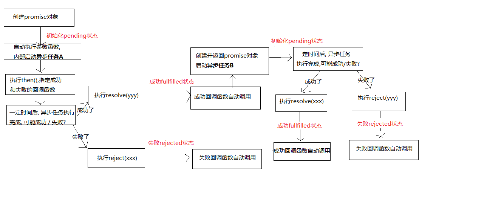

## 目录
#### 一.ECMAScript(ES)
* [概念](#one)

#### 二.ES5
* [严格模式](#two)
* [JSON对象](#three)
* [Object扩展](#four)
* [Array扩展](#five)
* [Function扩展](#six)

#### 三.ES6
* 常用
	* [let关键字](#seven)
	* [const关键字](#eight)
	* [变量的解构赋值](#nine)
	* [模版字符串：简化字符串的拼接](#ten)
	* [简化的对象写法](#eleven)
	* [箭头函数](#twelve)
	* [点点点运算符](#thirteen)
	* [形参默认值](#fourteen)
	* [Promise对象](#fifteen)
	* [class类](#sixteen)
	* [Module ES6模块化](#seventeen)
* 其他扩展
	* [字符串扩展](#eighteen)
	* [数值扩展](#nineteen)
	* [数组扩展](#twenty)
	* [对象扩展](#twentyone)
	* [Set和Map数据结构](#twentytwo)
	* [for...of循环遍历](#twentythree)
	
#### 四.ES7
* [指数运算符: ** 幂](#twentyfour)
* [Array.prototype.includes(value)](#twentyfive)

 
 
 
 
 

## 一.ECMAScript(ES)
#### 
概念

* 它是一种由ECMA组织(前身为欧洲计算机制造商协会)指定和发布的脚本语言规范

* Javascript是ECMA的实现，术语ECMAScript和JavaScript表达的是同一个意思
* JS包含三个部分：  
    * ECMAScript (核心)  
    * 扩展(浏览器端)  
        * BOM(浏览器对象模型)
        * DOM(文档对象模型)
    * 扩展(服务器端)
        * Node
* ES的几个重要版本
    * ES5 09年发布
    * ES6(ES2015) 15年发布，也称为ECMA2015
    * ES7(ES2016) 16年发布，也称为ECMA2016(变化不大)
    
## 二.ES5
* 扩展学习参考  
	http://www.zhangxinxu.com/wordpress/2012/01/introducing-ecmascript-5-1/  
	http://www.ibm.com/developerworks/cn/web/wa-ecma262/  
	
#### 
1.严格模式

* 概念：除了正常运行模式(混杂模式)，ES5添加了第二种运行模式："严格模式"(strict mode)。  
这种模式使得Javascript在更严格的语法条件下运行
* 目的：
    * 消除Javascript语法的一些不合理，不严谨之处，减少一些怪异行为
    * 消除代码运行的一些不安全之处，保证代码运行的安全
    * 为未来新版本的Javascript做好铺垫
* 使用
    * 在全局或函数的第一条语句定义为: 'use strict';
    * 在全局中使用'use strict'，是全局环境下的严格模式，也可以在函数中使用严格模式  
    
            function(){  
                'use strict';    
                .......
            }
    * 如果浏览器不支持, 只解析为一条简单的语句, 没有任何副作用
* 语法和行为改变  

    1. 必须使用var声明变量： 
     
		    'use strict';//严格模式 
		    age = 12;//系统会报错  
		    var age = 12;//必须使用var
    
        > 非严格模式下不用var声明变量，变量会成为window的属性，会污染全局变量
    
    2.禁止自定义的函数中的this指向window 
    
        'use strict';//严格模式
        function Person(name,age){
            this.name = name;
            this.age = age;
            }
        var person = new Person('kobe',39);//此时的this是person实例
        Person('kobe',39);//函数自调用，此时的this指向window，**_**严格模式下**_**，系统会报错
         setTimeout(function(){
            console.log(this);//此时的this是window，但是严格模式下不会报错(自调用函数)
         },2000)
         
    3.创建eval作用域  
    eval('参数'),eval是一个函数，它需要一个字符串参数，可以动态解析执行代码字符串。  
    在ES5中eval有自己的作用域，需要设置严格模式
      
        'use strict';
        var age = 12;
        eval('var age=10,alert(age)');//此时alert的age＝10，输出的age＝12，eval中的age在eval作用域中，不会影响全局中的的age
        console.log(age);
    
        对比-------在非严格模式下：
        var age = 12;
        eval('var age=10,alert(age)');//此时返回的age＝10，eval中的age在全局作用域中，把之前的age覆盖---有安全隐患
        console.log(age);
    
    4.对象不能有重名的属性
    
            var obj = {
                name:'kobe';
                name:'tym';//会报错，不允许这种情况出现。
            }
            
#### 
2.JSON对象

* JSON.stringify(obj/arr)  
JSON 通常用于与服务端交换数据。
在向服务器发送数据时一般是字符串。
我们可以使用 JSON.stringify() 方法将 JavaScript 对象转换为字符串。
   
* JSON.parse(json)
将一个 JSON 字符串转换为对象。
    
          var obj = { name: 'Tom', age: 12 };
          //将js对象解析为json对象
          var json = JSON.stringify(obj); 
          console.log(json);//返回的是json对象
          //将json对象解析为js对象
          var obj2 = JSON.parse(json);
          console.log(obj2);//返回的是js对象
        
          var arr = [{ name: 'Tom', age: 12 }, { name: 'Tom2', age: 13 }];
          //将js数组解析为json数组
          json = JSON.stringify(arr);
          console.log(json); //返回的是json数组
          //将json数组解析为js数组
          var arr2 = JSON.parse(json);
          console.log(arr2); //返回的是js数组
          
#### 
3.Object扩展

ES5给Object扩展了好一些静态方法, 常用的2个:  
1.Object.create(prototype, [descriptors])---(这个方法给Object对象用)

  * 作用: 以指定对象为原型创建新的对象
    
        var obj = {
            name:"tangtang",
            age:27
        };
        var obj2 = {};
        obj2 = Object.create(obj);
        console.log(obj2);//此时的obj2是以obj为原型创建的对象，其原型中包含obj的属性和方法
        
  * 指定新的属性, 并对属性进行描述  
    value : 指定值  
    writable : 标识当前属性值是否是可修改的, 默认为true   
    
        var obj = {
            name:"tangtang",
            age:27
         };
         var obj2 = {};
         obj2 = Object.create(obj,{
            sex:{ //新的属性
                value:'男'，//指定值
                writable ： false；//标识不可修改, 默认是true
            }
         })
         console.log(obj2);//此时的obj2包含一个新的属性sex，值为"男"，且不可修改
    
2.Object.defineProperties(object, descriptors)  

* 作用: 为指定对象定义扩展多个属性
* get : 用来获取当前属性值的回调函数  
* set : 用来监视当前属性值变化的回调函数
* 存取器属性：setter,getter一个用来存值，一个用来取值
 
        var obj = {
            firstName:"kobe",
            lastName:"brayant"
        }
        Object.defineProperties(obj,{//为指定对象定义扩展属性
            fullName:{//属性名
                get:function(){ //用于获取当前属性值的回调方法，当读取当前属性值时自动调用
                    return this.firstName + "" + this.lastName;
                }，
                set:function(value){ //用于监视当前属性值变化的回调方法，当给当前属性设置新的值时调用
                    var names = value.split("-")
                    this.firstName = names[0];
                    this.lastName = names[1];
                }
            }
        });
        console.log(obj.fullName);//返回'kobe brayant'
        obj.firstName = "tang";
        obj.lastName = "mingming";
        console.log(obj.fullName);//返回"tang mingming"
        obj.fullName = 'Allen-Iverson';
        console.log(obj.fullName);//在没有定义set回调函数前，不能直接修改fullname属性-----定义set函数后返回Allen-Iverson
        console.log(obj.firstName, obj.lastName)//返回Allen Iverson

3.对象本身的两个方法  

* get propertyName(){} 用来获取当前属性值的回调函数
* set propertyName(){} 用来监视当前属性值变化的回调函数
    > 有点类似于function fullname(){     };

        var obj = {
                firstName : "tang",
                lastName : "yueyue",
                get fullName(){
                    return this.firstName + this.lastName;
                },
                set fullName(value){
                    console.log(value+"---value值");
                    var names = value.split(' '); //注意拼串的时候以什么来拆分，如果以空串拆分获得的是'ta'
                    this.firstName = names[0];
                    this.lastName = names[1];
                }
            }
            console.log(obj.fullName+"-----");
            obj.fullName = 'tang mingming';
            console.log(obj.fullName+"+++++");
            
#### 
4.Array扩展(array实例的方法)

1. Array.prototype.indexOf(value) : 得到值在数组中的第一个下标
2. Array.prototype.lastIndexOf(value) : 得到值在数组中的最后一个下标
3. Array.prototype.forEach(function(item, index){}) : 遍历数组
4. Array.prototype.map(function(item, index){}) : 遍历数组返回一个新的数组，返回加工之后的值
5. Array.prototype.filter(function(item, index){}) : 遍历过滤出一个新的子数组,返回条件为true的值
    
    > 这些方法对原数组不产生影响
     
         /*
            需求:
            1. 输出第一个6的下标
            2. 输出最后一个6的下标
            3. 输出所有元素的值和下标
            4. 根据arr产生一个新数组,要求每个元素都比原来大10
            5. 根据arr产生一个新数组, 返回的每个元素要大于4
            */
           var arr = [4, 6, 8, 6, 3];
           console.log(arr.indexOf(6));//---1
           console.log(arr.lastIndexOf(6));//---3
           arr.forEach(function (item,index) {
               console.log(item,index);
           });
           var arr1 = arr.map(function (item,index) {
               return item+10;
           });
           console.log(arr1); //(5) [14, 16, 18, 16, 13]
           var arr2 = arr.filter(function (item,index) {
               return item>4;
           })
           console.log(arr2);//(3) [6, 8, 6]
           
#### 
5.Function扩展

1. Function.prototype.bind(obj) :
  * 作用: 将函数内的this绑定为obj, 并将函数返回
2. 面试题: 区别bind()与call()和apply()?
  * 都能指定函数中的this
  * call()/apply()是立即调用函数，call和apply指定this之后自动调用函数本身
    > call()和apply()区别在于传参数的方法不同  
    fun.call(指定的this对象,参数)  
    fun.apply(指定的this对象,[参数])
    
  * .bind()返回的是函数本身,返回之后this改变，需要调用函数(传参方式和call一样)
    
    
	          function fun(age) {
	              this.name = 'kobe';
	              this.age = age;
	          }
	          var obj = {};
	          fun.call(obj,39);
	          console.log(obj);//Object {name: "kobe", age: 39}
	          fun.apply(obj,[18]);
	          console.log(obj);//Object {name: "kobe", age: 18}
	          fun.bind(obj,20)();
	          console.log(obj);//Object {name: "kobe", age: 20}

## 三.ES6
webstorm设置ES6  
## 常用

1.let关键字

> 使用let取代var是趋势 
 
  * 作用:  
  与var类似, 用于声明一个变量
  * 特点:    
  在块作用域内有效  
  不能重复声明 (会报错，利于开发，防止覆盖)  
  不会预处理, 不存在变量提升
    
    > 预处理／变量提升  
    js引擎在解析js代码时会先找到var和function，找到var变量先声明但是不赋值
  * 应用：  
  循环遍历加监听  
  * 实例：
    
    html：  
     
    <button>测试1</button>
     
    <button>测试2</button>
     
    <button>测试3</button>
      
    script代码1：
        
        let btns = document.getElementsByTagName('button');
          for(var i=0;i<btns.length;i++){
              btns[i].onclick = function () {
                  alert(i);//每次点击返回的都是3
              }
          }//主线程遍历循环，回调函数在事件队列里，主线程执行完成之后，执行回调函数，此时再点击i＝3，是最后一次循环后i++之后的值
    
     script代码2：
        
         for(var i=0;i<btns.length;i++){
               btns[i].index = i;//为每一个按钮添加index属性
               btns[i].onclick = function () {
                   alert(this.index);//分别返回0，1，2
               }
           }
  
      script代码3：
      
       > 闭包：  
         函数存在嵌套，内部函数引用外部函数的局部变量，会导致局部变量的生命周期延长，函数体执行完作用域就销毁了
       缺点：存在安全隐患
       
          //使用闭包
          for(var i=0;i<btns.length;i++){
              (function (i) {//IIFE 立即执行函数
                  alert(i);
              })(i)//此时的实参是0，1，2
          }
      script代码4：
      
          for(let i=0;i<btns.length;i++){
              btns[i].onclick = function () {
                  alert(i);
              }
          }//let有自己的块作用域，在全局作用域下，每次遍历会生成自己的作用域，保存自己的变量i --------(其实不太懂)

2.const关键字

* 作用  
 定义一个常量  
* 特点  
 不能修改  
 其他特点同let
* 应用  
 保存不用改变的数据  
* 实例  

        const a = 'abc'
          // a = 123 // Assignment to constant variable.
        console.log(a) //abc

         if(true) {
            const b = 'abc';
            console.log(b);// abc
          }
          console.log(b) //  b is not defined ----let和const的块作用域
    

3.变量的解构赋值

* 理解：  
根据属性名，从对象或数组中提取数据, 并赋值给变量
* 对象的解构赋值---根据属性名，按需取，可以只取1个，如果获取未定义的属性，返回undefined  

		let {a,b}={a:'a',b:'b'}
		let{a,b}={obj}
* 数组的解构赋值---根据索引下标 
  
		let[a,b]=[1,'tangtang']
* 用途  
给多个形参赋值
* 实例应用

          let person = {
            name : 'Tom',
            age: 12,
            sex: "男"
          }
          const arr = [2, 'abc', true]
        
          //使用多条语句分别取出对象的多个属性
          let name = person.name
          let age = person.age
          //解构对象(简洁)
          let {name, age} = person
          console.log(name, age)
        
          //解构数组(用得不多)
          let [a, b] = arr
          console.log(a, b)
        
          // 应用: 给多个形参赋值
          function showPerson(p) { //不用解构语法
            console.log(p.name, p.age)
          }
          function showPerson2({name, age}) { //使用解构语法
            console.log(name, age)
          }
          showPerson(person)
          showPerson2(person)
          

4.模版字符串：简化字符串的拼接

* 模版字符串必须用｀｀包含
* 变化的部分使用 `$｛....｝` 定义  
* 实例应用
    
          const user = {
             name: 'Tom',
             age: 12
          }
          //拼字符串
          console.log('我叫' + user.name + ', 10年后年方' + (user.age + 10))
          //模板字符串
          console.log(`我叫${user.name}, 10年后年方${user.age + 10}`)

5.简化的对象写法

* 省略同名的属性值
* 省略方法的function
* 实例应用：
    
          let name = 'Tom';
          let age = 12;
          function test () {
            console.log('test()')
          }
          let person = {
            name,
            age,
            setName (name) {
              this.name = name;
            },
            test
          };
          console.log(person);//Object {name: "Tom", age: 12, setName: function, test: function}
          person.test();//test()
          person.setName('tangtang');
          console.log(person);//Object {name: "tangtang", age: 12, setName: function, test: function}
          
     
     

6.箭头函数

* 作用：定义匿名函数

* 基本语法：
    * 没有参数:  `() => console.log('xxxx')//()不能省略`  
    * 一个参数:  `i => i+2//()可以省略`  
    * 大于一个参数:  `(i,j) => i+j//()不能省略`
    * 函数体不用大括号: 默认返回结果
    * 函数体如果有多个语句, 需要用 `{}` 包围，若有需要返回的内容，需要手动返回`return`
* 使用场景：多用来定义回调函数
* 箭头函数的特点：
    * 简洁
    * 箭头函数没有自己的this，箭头函数的this不是调用的时候决定的，而是由在定义的时候处在的对象决定
    * 箭头函数的this查找像作用域的变量查找一样，一层一层的往上找，直到找到window对象。如果箭头函数的外层有函数，则其this和外层函数的this一样，否则this是window。  
    <button id="btn">测试箭头函数this</button>  ` <button id="btn">测试箭头函数this</button>`  
    <button id="btn2">测试箭头函数this</button>   ` <button id="btn2">测试箭头函数this</button>`
    
                let btn = document.getElementById('btn');
                //箭头函数
                let btn2 = document.getElementById('btn2');
                btn2.onclick = () => {
                    console.log(this);   //------>this是window
                    alert('箭头函数');
                };
            
                let obj = {
                    name : 'kobe',
                    age : 39,
                    getThis : function () {
                        btn.onclick = () => {
                            console.log(this);  //------>this是obj
                            console.log(this.name, this.age);
                        };
                    }
                };
                obj.getThis();//obj
                
                let arr = [1,2,3,4];
                arr.forEach((item, index) => console.log(item, index));
    
    
* 实例应用：  
   
            //没有形参，函数体只有一条语句
            let fun = () => console.log('fun()');
            fun();
            //一个形参，函数体只有一条语句
            let fun1 = x => x;
            console.log(fun1('fun()'));//fun()
            //形参有一个以上的参数，函数体只有一条语句
            let fun2 = (x, y) => x + y;
            console.log(fun2(2, 15));
            //形参有一个以上的参数，函数体有多条语句
            let fun3 = (x, y) => {
                console.log('fun3()');
                return x + y;
            };
            console.log(fun3(3, 9));
            

7.点点点运算符

* rest(可变)参数 用来收集形参变量成为数组

          function sum(a,...values) {
            let result = 0
            values.forEach((item) => {
              result += item
            })
            return result
          }
          console.log(sum(2, 3, 4))//7
          console.log(sum(2, 3, 4, 5))//12
          
* 扩展运算符
        
          let arr = [2, 3, 5]
          let arr1 = [1, 7]
        
          arr1 = [1, ...arr , 7]
          console.log(arr1)//Array(5)

8.形参默认值(函数调用未传参数时参数的默认值)

* 实例应用   
    
         function Point(x = 1, y = 2) {
            this.x = x;
            this.y = y;
          }
        
          let p = new Point();
          console.log(p);//Pointx: 1 y: 2__proto__: Object
        
          p = new Point(3, 4);
          console.log(p);//Pointx: 3 y: 4__proto__: Object
   

9.Promise对象

* 理解
    * Promise对象: 代表了未来某个将要发生的事件(通常是一个异步操作)
    * 有了promise对象, 可以将异步操作以同步的流程表达出来, 避免了层层嵌套的回调函数(俗称'回调地狱')
    * ES6的Promise是一个构造函数, 用来生成promise实例
    
* 使用promise基本步骤(2步):
    * 创建promise对象
    
            let promise = new Promise((resolve, reject) => {
                  //执行异步操作
                  if(异步操作成功) {
                    resolve(value);
                  } else {
                    reject(errMsg);
                  }
            })
    * 调用promise的then()-----then中的函数为异步调用
        
            promise.then(
                  result => console.log(result),
                  errorMsg => alert(errorMsg)
                )

* promise对象的3个状态
    * pending: 初始化状态
    * fullfilled: 成功状态
    * rejected: 失败状态
    
* 理解promise的执行过程-------(最终返回的是promise)

     
   
            let promise = new Promise((resolve,reject)=>{
                //new promise对象自动执行实参的回调函数且为同步执行---->初始化promise状态为pending
                console.log('111111');
                //启动异步任务，以延时函数举例
                setTimeout(()=>{
                    console.log('33333');
                    //resolve()////异步任务执行成功 调用resolve() 修改promise的状态为fullfilled  调用then里成功的回调函数(第一个参数)
                    reject()////异步任务执行失败 调用reject() 修改promise的状态为rejected  调用then里失败的回调函数(第二个参数)
                },2000)
            });
            console.log('2222')
            promise.then(()=>{
                console.log('成功了')
              },()=>{
                console.log('失败了')//输出结果为111111...2222....3333...失败了
              })
* 实例应用：
    
        //定义一个请求news数据的函数
            function getNews(url) {
                //创建promise对象
                let promise = new Promise((resolve,reject)=>{
                //初始化promise的状态为pending
                //发送异步ajax请求
                    //创建XMLHttpRequest对象
                    let xmlHttp = new XMLHttpRequest();
                    //监视
                    xmlHttp.onreadystatechange = function () {
                        //判断状态
                        if(this.readyState === 4 ){
                            if(this.status === 200){
                                let data = this.responseText;
                                resolve(data);
                            }else{
                                reject('失败了。。。。');
                            }
                        }
                    }
                    //xmlHttp.responseType = 'json';//规定返回的数据格式，自动将json数据转换成js对象/数组
                    xmlHttp.open('GET',url);//创建请求方式及连接
                    xmlHttp.send();//发送请求
                })
                //将promise对象返回
                return promise;
            }
            getNews('http://localhost:3000/news?id=2')
                .then((data)=>{//then里的回调函数为异步调用
                    console.log(data);
                    console.log(typeof data);
                    let obj = JSON.parse(data);
                    let url = 'http://localhost:3000'+obj.commentsUrl;
                    document.write(data);
                    document.write(' '+url);
                    return getNews(url)//继续发送请求 并 返回promise对象
                },()=>{
                    console.error('失败了～～～～～～～');
                })
                .then((data)=>{
                    document.write("     "+data);
                },()=>{
                    console.error(error);
                })
                

10.class类

* 通过class定义类
* 在类中通过constructor定义构造方法
* 通过new来创建类的实例
* 通过extends来实现类的继承
* 通过super调用父类的构造方法
* 重写从父类中继承的一般方法
* 实例操作
        
        //定义类
            class Person{
                //定义构造方法
                constructor(name,age){
                    this.name = name;
                    this.age = age;
                }
                //定义类的一般方法
                printInfo (){
                    console.log(this.name+"......"+this.age);
                }
            }
            //根据类创建实例对象
            var person = new Person('tangtang',27);
            console.log(person);//Person {name: "tangtang", age: 27}
            person.printInfo();//tangtang......27
        
            //定义子类
            class Son extends Person{
                //定义构造方法
                constructor (name,age,salary){
                    super(name,age);//调用父类Person的构造方法
                    this.salary = salary;//自己的构造方法
                }
                // 重写: 子类自动拥有父类的方法, 但方法的实现不能满足当前的要求, 就需要重写
                printInfo(){
                    console.log(this.name + " : " + this.age + " : " + this.salary);
                }
            }
            //创建子类的实例
            var son = new Son('tym',18,200000);
            console.log(son);
            //son.printInfo();//子类未重写方法的时候返回的值：tym......18 ---重写之前调用的是父类的方法
            son.printInfo();//重写之后返回的值：tym : 18 : 200000 ---重写之后调用的是子类自己的方法
            

11.Module----ES6模块化

* ES6内置了模块化的实现
* http://es6.ruanyifeng.com/#docs/module
* 依赖模块需要编译打包处理
* 语法:
    * 导出模块: export
        
            //分多次导出模块的多个部分  
            export class Emp{  }
            export function fun(){  }
            export var person = {};
            
            //一次导出模块的多个部分
            class Emp{  }
            function fun(){  }
            var person = {};
            export {Emp, fun, person}
            
            //default导出(只能有一个)
            export default {}
            
    * 引入模块: import
    
            import defaultModule from './myModule';  //导入默认的
            import {Emp} from './myModule'; //导入指定的一个
            import {Emp, person} from './myModule'; //导入指定的多个
            import * as allFromModule from './myModule';  //导入所有
            
* 实现(浏览器端) 
     * 所有浏览器还不能直接识别ES6模块化的语法 
     * 解决
         * 使用Babel将ES6编译为ES5代码--->ES5(使用了CommonJS) ----浏览器还不能直接执行
         * 使用Browserify编译打包js---->浏览器可以运行
        
## 其他扩展
#### 
1.字符串扩展

1. includes(str) : 判断是否包含指定的字符串
2. startsWith(str) : 判断是否以指定字符串开头
3. endsWith(str) : 判断是否以指定字符串结尾
4. repeat(count) : 重复指定次数
* 实例应用

        let s = 'tangtang';
        console.log(s.includes('a'));//f
        console.log(s.includes('c'));//t
        
        console.log(s.startsWith('a'));//f
        console.log(s.startsWith('t'));//t
        
        console.log(s.endsWith('a'));//f
        console.log(s.endsWith('g'));//t
        
        console.log(s.repeat(2));//tangtangtangtang
        
#### 
2.数值扩展

1. 二进制与八进制数值表示法: 二进制用0b, 八进制用0o
    
        console.log(0b1010) // 10
        console.log(0o56) // 46
2. Number.isFinite(i) : 判断是否是有限大的数

        console.log(Number.isFinite(Infinity)) // false
        console.log(Number.isFinite(100000)) // true
                
3. Number.isNaN(i) : 判断是否是NaN
        
        console.log(Number.isNaN(3)) // false
        console.log(Number.isNaN(NaN)) // true
        console.log(Number.isNaN('abc')) // false
4. Number.isInteger(i) : 判断是否是整数

       console.log(Number.isInteger(12)); // true
       console.log(Number.isInteger(12.0)); // true
       console.log(Number.isInteger(12.1)); // false
5. Number.parseInt(str) : 将字符串转换为对应的数值
    
        console.log(Number.parseInt('123abc')); // 123
        console.log(Number.parseInt('ab123abc')); // NaN
                
6. Math.trunc(i) : 直接去除小数部分
        
        console.log(Math.trunc(123.923)); // 123
        
#### 
3.数组扩展

1. Array.from(v) : 将伪数组对象或可遍历对象转换为真数组

        //获取到的btns是一个伪数组
        let btns = document.getElementsByTagName('button')
        console.log(btns.length)
        //将伪数组对象或可遍历对象转换为真数组
        Array.from(btns).forEach(function (item, index) {
            console.log(item, index)
        })
2. Array.of(v1, v2, v3) : 将一系列值转换成数组
        
        //Array.of(v1, v2, v3) : 将一系列值转换成数组E
        let obj = {name:"kobe"}
        let num = 12
        let str = 'abcd'
        let arr = Array.of(obj, num, str)
        console.log(arr)//Array(3)

3. find(function(value, index, arr){return true}) : 找出第一个满足条件的元素
        
        let arr1 = [6, 4, 7, 2]
        //找出第一个小于5的元素
        let number = arr1.find((item, index) => item < 5)
        console.log(number)//4
4. findIndex(function(value, index, arr){return true}) : 找出第一个满足条件返回true的元素下标
        
        let arr1 = [6, 4, 7, 2]
        //找出第一个小于5的元素的下标
        number = arr1.findIndex(function (item, index) {
            return item < 5
        })
        console.log(number)//1
         
#### 
4.对象扩展

1. Object.is(v1, v2)
  * 判断2个数据是否完全相等
        
          Object.is(v1, v2)
          console.log('abc' === 'abc');//true
          console.log(Object.is('abc', 'abc'));//true
          console.log(0 === -0);//true
          console.log(Object.is(0, -0));//false
          console.log(NaN === NaN);//false
          console.log(Object.is(NaN, NaN));//true
2. Object.assign(target, source1, source2..)
  * 将源对象的属性复制到目标对象上
  
          let target = { a: 1, b: 1 };
          let source1 = { b: 2, c: 2 };
          let source2 = { c: 3, d: 4 };
          Object.assign(target, source1, source2);
          console.log(target);
          
3. let obj2 = {};  

   obj2.__proto__ = obj1;  
* 直接(显式)操作__proto__属性  
  
        let obj1 = {
            name: 'Tom',
            setName(name) {
              this.name = name;
            }
          };
          let obj2 = {};
          obj2.__proto__ = obj1;
          obj2.setName('Jack');
          console.log(obj2.name);
  
#### 
5.Set和Map数据结构

1.Set容器 : 无序 不可重复 的多个value的集合体
  * Set()  
  
        let set = new Set 
        console.log(set)//返回的是一个空容器
  
  * Set(array)主要为数组去重 
        
        let set = new Set([1,2,3,1,4,3,5]);
        console.log(set);
  * add(value)  
        
        set.add(7);
  * delete(value)  
        
        set.delete(7)
  * has(value)
  判断容器中是否含有某个值，返回的是布尔值
  * clear()清空容器
  * size  
        
        console.log(set.size)//类似于数组的length
  
2.Map容器 : 无序的 key不重复的多个key-value的集合体
* Map()  
* Map(array)
        
        let map = new Map([['abc',222],['s',22]]);//放的是二维数组
        console.log(map)//返回
* set(key, value)//添加

        map.set('username','kobe');
* get(key)

        console.log(map.get('username'));
* delete(key)
        
        map.delete('username');
        console.log(map);
* has(key)

        console.log(map.has('username'))//返回的是布尔值
* clear()清空容器
* size 
        
        console.log(map.size);
        
#### 
6.for...of循环遍历

1. 遍历数组

        let arr = ['a', 'b', 'c', 'd'];
          for (let value of arr) {
            console.log(value);
          }
2. 遍历Set
    
        let set = new Set(['hao', 'de', 'hao']);
          for (let value of set) {
            console.log(value);
          }
3. 遍历Map
        
        let map = new Map();
          map.set('name1', 'JACK1');
          map.set('name3', 'JACK3');
          map.set('name2', 'JACK2');
          for (let [key,value] of map) {
            console.log(key + ":" + value);
          }
4. 遍历字符串
        
         let str = 'atguigu';
          for (let s of str) {
            console.log(s);
          }
5. 遍历伪数组
        
          let btns = document.getElementsByTagName('button');
          for(let btn of btns){
              console.log(btn);//获取到每一个button
          }
          
## 四.ES7

1. 
指数运算符: **  幂

        
        console.log(2 ** 3); //8
2.  
Array.prototype.includes(value)
: 判断数组中是否包含指定value(实例的方法)

        let arr = [1,2,3,4,6];
        console.log(arr.includes(2));//true
        console.log(arr.includes(5));//false
        
