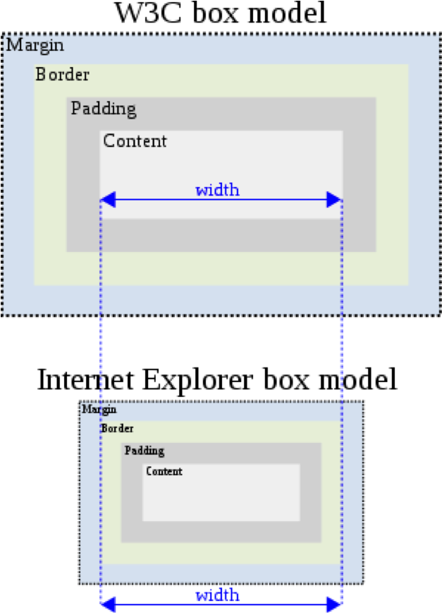

## 目录
## CSS 布局那些事
* [什么是布局？](#a)
* [盒模型](#b)
    * 标准盒模型
    * 怪异盒模型
    * 标准盒模型 VS 怪异盒模型
    * CSS属性box-sizing
* [传统布局及相关技术](#c)
    * 右外边距失效
    * 负外边距 - 两列布局
    * BFC – 两列布局
    * 三列布局
    * 基于table-cell布局（局部）
* [伸缩盒模型(flex)](#d)

## CSS 布局那些事
#### 
一.什么是布局？

* 根据实际需求，把HTML元素通过CSS样式显示在网页中。
    * PC端布局特点
        * 会为网页设置一个默认宽度，倾向像素单位（px）
    * 移动端布局特点
        * 基于视口作为网页宽度，更倾向使用相对单位（% , rem，vh,  wh 等）
#### 
二.盒模型

1. 标准盒模型

    
2. 怪异盒模型

    
3. 标准盒模型VS怪异盒模型

    
4. CSS属性box-sizing
    * box-sizing: border-box;
        * 元素设置宽度按 border-box 宽度计算
    * box-sizing: content-box; 
        * (默认值) 元素设置宽度按 content-box宽度计算
#### 
三.传统布局及相关技术

1. 右外边距失效

    * 父元素空间不足会导致子元素右外边距失效！
2. 负外边距 - 两列布局
    * 使用负外边会产生一个元素“悬浮”在另一个元素上面的效果。
        > 注意：被覆盖的元素文本内容不会被覆盖！
    * 使用场景:
        * 左侧自适应，右侧固定宽度布局效果
    * 步骤:                                                                                                                                                                                                                                       
        * 为浮动元素（.box）设置右侧外边距为负
        * 右侧外边距绝对值等于紧邻兄弟元素的宽度
        * 为紧邻兄弟元素设置左浮动
    * 注意事项：
        * ： `.box`需要添加一个子元素，子元素外边距为正值，该值等于父元素的负边距的绝对值。同时不要给子元素指定宽度！！！通过上述处理，就不会出现覆盖内容的问题！
3. BFC – 两列布局
    * 设置元素浮动，紧邻兄弟元素“占有”该元素位置，通过开启紧邻兄弟元素BFC（overflow: hidden），防止其上方出现浮动元素。
    * 使用场景：
        * 左侧固定，右侧自适应
4. 三列布局
    * 综合负右外边距，BFC方式，实现中间自适应，两侧固定布局。
5. 基于table-cell布局（局部）
    * 为元素设置 display: table-cell 该元素就具有了 `<td>` 的特性
        * 可以通过为该元素设置verticale-align 轻松实现对齐内容及其子元素在垂直方向的位置
        * 我们推荐在局部布局中使用！不推荐整体布局！
    * 制作多列等宽自适应布局
        * 父元素  display:  table; width: 100%        
        * 布局元素（子元素 ） display: table-cell;        
        * 子元素之间的空隙，通过一个正常的div分割即可。        
        * 如果存在多行，需要在包裹一个 display: table-row（<tr>）
#### 
四.伸缩盒模型(flex)

