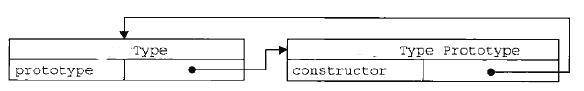
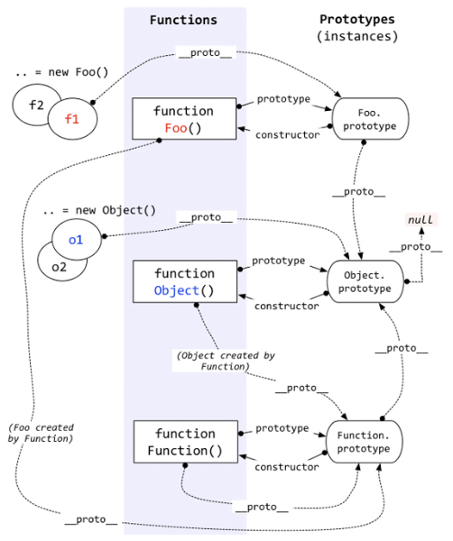
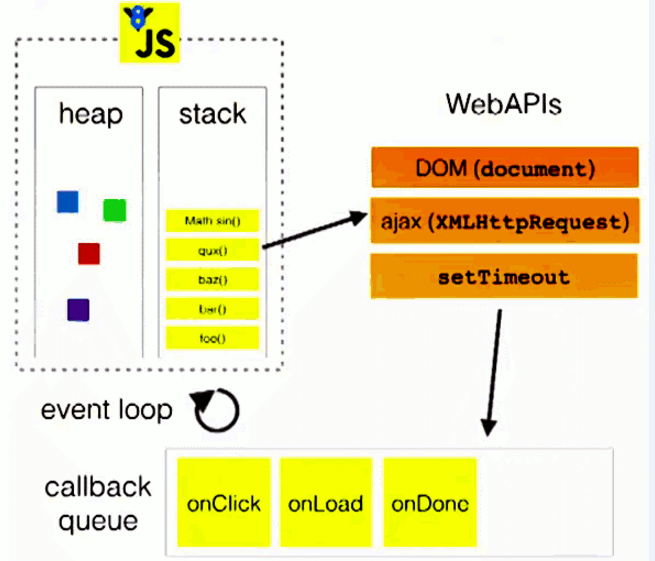

#### 

一.数据类型
1. 
分类

    * 基本(值)类型
        * String: 任意字符串
        * Number: 任意的数字
        * boolean: true/false
        * undefined: undefined
        * null: null
    * 对象(引用)类型
        * Object: 任意对象
        * Function: 一种特别的对象(可以执行)
        * Array: 一种特别的对象(数值下标, 内部数据是有序的)
2. 
判断

    * typeof:(typeof 返回的是字符串)
        * 可以判断：undefined/ 数值 / 字符串 / 布尔值 / function
        * 不可以判断：null与object  object与array   
            _因为typeof null返回object，typeof array 返回 object_
    * instanceof:
        * 判断对象的具体类型
    * === 
        * 可以判断： undefined，null
             
                var a
                console.log(a, typeof a) // undefined  字符串'undefined'
                console.log(a===typeof a) // false
                a = null
                console.log(typeof a, a===null)  // 'object'   true
    * 看代码时: 需要知道一个标识名称的数据类型
            
            var b1 = {
                b2: [1, 'abc', console.log],
                b3: function () {
                  return function () {
                    return function () {
                      console.log('++++++')
                    }
                  }
                }
              }
            
              console.log(typeof b1, typeof b1.b2, typeof b1.b3);   // 'object' 'object'  'function'
              console.log(typeof b1.b2[2]); // 'function'
            
              b1.b2[2]();
              b1.b3()()(); //返回 ++++++
              
3. 
undefined与null的区别?

    * undefined代表定义未赋值
        
              var a
              console.log(a) // undefined 定义未赋值的变量
              a = {}
              console.log(a.a) // undefined 未定义的对象属性
    * nulll定义并赋值了, 只是值为null
    
              var b = null
              console.log(b) // null
              a.b = null
              console.log(a.b) // null
4. 
什么时候给变量赋值为null呢?

    * 初始赋值, 将要作为引用变量使用, 但对象还没有确定
            
            var obj = null // 初始赋值, 表明将要赋值为对象
            obj = {}  // 中间赋值并处理
    * 结束前, 让对象成为垃圾对象(被垃圾回收器回收)
        
            obj = {}  // 中间赋值并处理
            obj = null // 结束前, 让对象成为垃圾对象(被垃圾回收器回收)
5. 
严格区别变量类型与数据类型？

    * js的变量本身是没有类型的, 变量的类型实际上是变量内存中数据的类型
    * 变量的类型(变量内存值的类型)
        * 基本类型: 保存基本类型数据的变量
        * 引用类型: 保存对象地址值的变量
    * 数据的类型
        * 基本类型
        * 对象类型
        
                  var obj1 = function () { // new Function()
                  } // obj1引用类型的变量: 存储的是地址值
                  console.log(obj1 instanceof Array) 
                  //此时判断的是引用变量obj1引用地址中的值的数据类型
                  
                  var obj2 = 'abc'   // obj2基本类型的变量: 存储的是基本类型的值
#### 二. 数据 变量 内存

1. 
什么是数据?

    * 数据是存储在内存中代表特定信息的'东东'，本质上是0101...
    * 数据的特点: 可传递，可运算
    * 一切皆数据
    * 内存中所有操作的目标: 数据
        * 算数运算 
        * 逻辑运算
        * 赋值
        * 运行函数
2. 
什么是内存？

    * 内存条通电后产生的可储存数据的空间(临时的)
    * 内存产生和死亡：内存条(电路板)=>通电=>产生内存空间=>存储数据=>处理数据=>断电=>内存空间和数据都消失
    * 一块小内存的2个数据
        * 内部存储的数据
        * 地址值
    * 内存分类
        * 棧: 全局变量／局部变量
        * 堆: 对象(任意类型)
3. 
什么是变量？

    * 可变化的量，由变量名和变量值成
    * 每个变量都对应的一块小内存，变量名用来查找对应的内存，变量值就是内存中保存的数据
4. 
内存，数据，变量三者的关系

    * 内存是存储数据的空间
    * 变量是内存的标识
        
             var a = 2  // 2是数据,保存在某块小内存中, a是内存的标识名称
             var b = a  // 将a的值保存到b中(复制粘贴)
             var c = a + b
5. 
问题：var a = xxx, a内存中到底保存的是什么?

    * xxx是基本数据, 保存的就是这个数据
    * xxx是对象, 保存的是对象的地址值
    * xxx是一个变量, 保存的xxx的内存内容(可能是基本数据, 也可能是地址值)
                
                  var a = 3   // 3
                  a = function () { // 地址值
                  }
                  
                  var b = 'abc' // 'abc'
                  a = b // 'abc'
                  b = {}
                  a = b // 地址值
6. 
关于引用变量赋值问题

    * 2个引用变量指向同一个对象, 通过一个变量修改对象内部数据, 另一个变量看到的是修改之后的数据
        
            var a = {m: 2}
              var b = a
              b.m = 3
              console.log(a.m) // 3
            
              function fn1(a) {
                a.m = 4 // 通过引用变量改变对象内部的数据, 所有指向对象的引用变量都看到最新的数据
              }
              fn1(b)
              console.log(a.m, b.m) // 4 4
    * 2个引用变量指向同一个对象, 让其中一个引用变量指向另一个对象, 另一引用变量依然指向前一个对象                
                
                  var c = {n: 3}
                  var d = c
                  c = {x: 4}
                  console.log(d.n, d.x) // 3 undefined
                  c.n = 5
                  console.log(d.n) // 3
                  
                  
                  function fn2 (d) {
                      d = {n: 6} 
                      // 改变一个引用变量的指向, 原先的对象没有变, 
                      其它的引用变量看到的还是原来的对象
                  }
                  fn2(d)
                  console.log(d.n) // 3
7. 
关于数据传递的问题

    * 问题：在js调用函数时传递变量参数时, 是值传递还是引用传递
        * 理解1: 都是值(基本/地址值)传递
        * 理解2: 可能是值传递, 也可能是引用传递(地址值)
            
                var a = 3
                  function fn (a) {
                    a = a +1
                  }
                  fn(a)
                  console.log(a)
                
                  function fn2 (obj) {
                    console.log(obj.name)
                  }
                  var obj = {name: 'Tom'}
                  fn2(obj)
8. 
内存管理

    * 问题: JS引擎如何管理内存?
        * 内存生命周期
            * 分配小内存空间，得到它的使用权
            * 存储数据，可以反复进行操作
            * 释放小内存空间
        * 释放内存
            * 局部变量：函数执行完自动释放
            * 对象：成为垃圾对象，垃圾回收器回收
                
                      var a = 3  // 全局变量运行完成后不消失
                      a = undefined // 还在
                      var obj = {}
                      obj = undefined  // {}成为垃圾对象, 后面就会被回收
                    
                      function fn () {
                        var b = {}
                      }
                      // 此时产生b? 没有，函数调用的时候才产生
                      fn() // b是自动释放, b所指向的对象是在后面的某个时刻由垃圾回收器回收
#### 三.对象

1. 
什么是对象?

    * 多个数据的封装体
    * 用来保存多个数据的容器
    * 一个对象代表现实中的一个事物
2. 
为什么要用对象?

    * 统一管理多个数据
3. 
对象的组成

    * 属性: 属性名(字符串)和属性值(任意)组成
    * 方法: 一种特别的属性(属性值是函数)
4. 
如何访问对象内部数据?

    * .属性名: 编码简单, 有时不能用
    * ['属性名']: 编码麻烦, 能通用
        
            var p = {
                name: 'atguigu',  //属性值是非函数
                age: 12,
                setName: function (name) {// 方法是特别的属性(属性值是函数)
                  this.name = name
                },
                showInfo: function () {
                  console.log(this.name, this.age)
                }
              }
              // 现实生活中的事物组成:
              /*
               状态: 静态 --->一般属性
               行为: 动态---->方法
               */
              console.log(p.showInfo()) //先输出 'atguigu' 12 再输出 undefined
              
            
              console.log(p.name, p['age'])
              p.setName('Jack')
              p['showInfo']()
5. 
问题：什么时候必须使用 ['属性名'] 的方式?

    * 属性名包含特殊字符: - 空格
    * 属性名不确定
            
              var obj = {}
              // 添加属性: content-tye : 'text/json'
              obj['content-tye'] = 'text/json'
              // 添加属性: 属性名是不确定
              var prop = 'yyy'
              var value = 'abc'
              // obj.prop = value
              obj[prop] = value
              console.log(obj['content-tye'], obj[prop])
#### 四. 函数

1. 
什么是函数?

    * 实现特定功能的n条语句的封装体
    * 只有函数是可以执行的, 其它类型的数据不能执行
2. 
为什么要用函数?

    * 提高代码复用
    * 便于阅读交流
        
          编写程序实现以下功能需求:
              1. 根据年龄输出对应的信息
              2. 如果小于18, 输出: 未成年, 再等等!
              3. 如果大于60, 输出: 算了吧!
              4. 其它, 输出: 刚好!
              
          function showInfo(age) {
              if(age<18) {
                console.log('未成年, 再等等!')
              } else if(age>60) {
                console.log('算了吧!')
              } else {
                console.log('刚好!')
              }
            }
          
            showInfo(17)
            showInfo(61)
            showInfo(24)
3. 
如何定义函数?

    * 函数声明
    * 表达式
4. 
如何调用(执行)函数?

    * test(): 直接调用
    * obj.test(): 通过对象调用
    * new test(): new调用
    * test.call/apply(obj): 临时让test成为obj的方法进行调用
            
              var obj = {
                test: function () {
                  this.xxx = 'abc'
                }
              }
              obj.test()
              console.log(obj.xxx)
            
              var obj2 = {}
              obj.test.call(obj2)   // 相当于obj2.test()
              console.log(obj2.xxx)
5. 
回调函数

    * 什么函数才是回调函数?
        * 你定义的
        * 你没有调
        * 但最终它执行了(在某个时刻或某个条件下)
    * 常见的回调函数?
        * dom事件回调函数 ==>发生事件的dom元素
        * 定时器回调函数 ===>window
        * ajax请求回调函数
        * 生命周期回调函数
6. 
IIFE

    * 理解
      * 全称: Immediately-Invoked Function Expression
    * 作用
      * 隐藏实现
      * 不会污染外部(全局)命名空间
      * 用它来编码js模块
            
            (function (window) {
                var a = 3
                console.log(a)
                function test() {
                  console.log(a)
                }
                function test2() {
                }
            
                window.mymodule = {
                  test,test2
                }
              })(window)
            
              myModule.test()
7. 
函数中的this

    * this是什么?
      * 任何函数本质上都是通过某个对象来调用的,如果没有直接指定就是window
      * 所有函数内部都有一个变量this
      * 它的值是调用函数的当前对象
    * 如何确定this的值?
      * test(): window
      * p.test(): p
      * new test(): 新创建的对象
      * p.call(obj): obj
            
                function Person(color) {
                    console.log(this)
                    this.color = color;
                    this.getColor = function () {
                      console.log(this)
                      return this.color;
                    };
                    this.setColor = function (color) {
                      console.log(this)
                      this.color = color;
                    };
                  }
                
                  Person("red"); //this是谁? window
                
                  var p = new Person("yello"); //this是谁? p
                
                  p.getColor(); //this是谁? p
                
                  var obj = {};
                  p.setColor.call(obj, "black"); //this是谁? obj
                
                  var test = p.setColor;
                  test(); //this是谁?  window
                
                  function fun1() {
                    function fun2() {
                      console.log(this);
                    }
                
                    fun2(); //this是谁?  window
                  }
                  fun1();
                  var obj2 = {}
                  var test2 = p.setColor.bind(obj2) // 返回的新函数指定了this为obj2
                  //注意使用bind()会返回一个绑定了this的新函数
                  
                  p.setColor('xxxx') // p
                  test2() // obj2
## 函数高级

#### 一.原型

1. 
原型

    * 函数的prototype属性
        
      * 每个函数都有一个prototype属性, 它默认指向一个Object空对象(即称为: 原型对象)
            
                  // 每个函数都有一个prototype属性, 它默认指向一个Object空对象(即称为: 原型对象)
                  console.log(Date.prototype, Date.prototype instanceof Object)
      * 原型对象中有一个属性constructor, 它指向函数对象
            
                  // Object空对象: 没有你定义的属性
                  function Fn () {// var Fn = new Function()
                
                  }
                  console.log(Fn.prototype)
                  console.log(Fn.prototype.constructor===Fn) // true
    * 给原型对象添加属性(一般都是方法)
      * 作用: 函数的所有实例对象自动拥有原型中的属性(方法)
            
                Fn.prototype.test = function () {
                    console.log('test()')
                  }
                
                  // Fn.prototype.test() // 可以执行, 但一般不这么做
                  // 原型对象上的方法是给函数的实例对象使用
                  var fn = new Fn()
                  fn.test()
2. 
显式原型与隐式原型

    * 每个函数function都有一个prototype，即显式原型(属性)
    * 每个实例对象都有一个__proto__，可称为隐式原型(属性)
    * 对象的隐式原型的值为其对应构造函数的显式原型的值
    * 内存结构
    * 总结:
      * 函数的prototype属性: 在定义函数时自动添加的, 默认值是一个空Object对象
      * 对象的__proto__属性: 创建对象时自动添加的, 默认值为构造函数的prototype属性值
      * 程序员能直接操作显式原型, 但不能直接操作隐式原型(ES6之前)
        
                function Fn() { // 内部: Fn.prototype = {}
                
                  }
                  // 显式原型(属性): 定义函数就会自动添加此属性, 默认指向一个空的object实例对象
                  console.log(Fn.prototype)
                
                  var fn = new Fn()  // 内部: this.__proto__ = Fn.prototype
                  console.log(fn.__proto__) // 隐式原型(属性)
                  // 实例对象的隐式原型等于对应的构造函数的显式原型
                  console.log(Fn.prototype === fn.__proto__) //true
                
                  Fn.prototype.test = function () {
                    console.log('test()')
                  }
                  fn.test()
                
                  // JS引擎: 解析执行我们的js代码的程序
3. 
原型链

    * 原型链(图解)
        
      * 访问一个对象的属性时，
        * 先在自身属性中查找，找到返回
        * 如果没有, 再沿着__proto__这条链向上查找, 找到返回
        * 如果最终没找到, 返回undefined
      * 别名: 隐式原型链
      * 作用: 查找对象的属性(方法)
            
            function Fn() {
                this.test1 = function () {
                  console.log('test1()')
                }
              }
              Fn.prototype.test2 = function () {
                console.log('test2()')
              }
             /* Fn.prototype.toString = function () {
                return '我是一个Fn的实例'
              }*/
            
              var fn = new Fn()
            
              fn.test1() // test1()
              fn.test2() // test2()
              console.log(fn.toString()) //
              console.log(fn.test3) // undefined
              //  fn.test3() // 报错: test3 is not function
              console.log(fn)
    * 构造函数/原型/实体对象的关系(图解)
    
                var o1 = new Object();
                var o2 = {};
        .png)
            
                函数的prototype指向的是一个{}
                console.log(Fn.prototype.__proto__===Object.prototype) // true
                console.log(Object.prototype.__proto__) // null
             
    * 构造函数/原型/实体对象的关系2(图解)
                
                function Foo(){  }
        .png)
                        
                 1. 所有函数都有prototype和__proto__属性
                 2. 所有函数的__proto__属性都相同, 都等于Function.prototype
                 3. 一个函数的prototype和__proto__属性不相同, Function除外
                 
                   console.log(Fn.__proto__===Object.__proto__) // true
                   console.log(Fn.__proto__===Fn.prototype) // false
                   console.log(Function.__proto__===Function.prototype) // true

4. 
原型链_属性问题

    * 读取对象的属性值时: 会自动到原型链中查找
    * 设置对象的属性值时: 不会查找原型链, 如果当前对象中没有此属性, 直接添加此属性并设置其值
    * 方法一般定义在原型中, 属性一般通过构造函数定义在对象本身上
    
              function Fn() {
              }
              Fn.prototype.x = 2
              var fn = new Fn()
              console.log(fn.x)  // 读取对象属性会看原型链
            
              var fn2 = new Fn()
              fn2.x = 3 // 给对象属性赋值不会看原型链
              console.log(fn.x)  // 2
              console.log(fn, fn2)
5. 
探索instanceof

    * instanceof是如何判断的?
        * 表达式: A instanceof B
        * 如果B函数的显式原型对象在A对象的原型链上, 返回true, 否则返回false
        
                  console.log(Object instanceof Function) // true
                  console.log(Object instanceof Object)
                  console.log(Function instanceof Object)
                  console.log(Function instanceof Function) // true
                  
        
    * Function是通过new自己产生的实例
                
                console.log(Object instanceof Function);
                console.log(Object instanceof Object);
                console.log(Function instanceof Function);
                console.log(Function instanceof Object);
                
                function Foo() {}
                console.log(Object instanceof  Foo);
        
6. 
面试题

    * 测试题1:
    
              var A = function() {
            
              }
              A.prototype.n = 1
            
              var b = new A()
            
              A.prototype = {
                n: 2,
                m: 3
              }
            
              var c = new A()
              console.log(b.n, b.m, c.n, c.m)
    * 测试题2：
            
            var F = function(){};
              Object.prototype.a = function(){
                console.log('a()')
              };
              Function.prototype.b = function(){
                console.log('b()')
              };
              var f = new F();
              f.a()
              f.b()
              F.a()
              F.b()
#### 二.执行上下文与执行上下文栈

1. 
变量提升与函数提升

    * 变量声明提升
        * 通过var定义(声明)的变量, 在定义语句之前就可以访问到
        * 值: undefined
    * 函数声明提升
        * 通过function声明的函数, 在之前就可以直接调用
        * 值: 函数定义(对象)    
                
            > 函数定义执行--->创建函数对象, 函数体没有执行;
              函数执行: 执行函数体
                
                console.log(a) // undefined
                  var a = 3
                  /*
                  var a  // 是在全局代码执行之前就执行了
                  a = 3
                   */
                  fn()
                  function fn() {   // 函数定义在全局代码执行之前就执行了
                    console.log('fn()')
                  }
    * 问题: 变量提升和函数提升是如何产生的?
2. 
执行上下文

    * 代码分类(位置)
        * 全局代码
        * 函数(局部)代码
    * 全局执行上下文
        * 在执行全局代码前将window确定为全局执行上下文
          * 对全局数据进行预处理
            * var定义的全局变量==>undefined, 添加为window的属性
            * function声明的全局函数==>赋值(fun), 添加为window的方法
            * this==>赋值(window)
          * 开始执行全局代码
    * 函数执行上下文
        * 在调用函数, 准备执行函数体之前, 创建对应的函数执行上下文对象(虚拟的, 存在于栈中)
        * 对局部数据进行预处理
          * 参形变量==>赋值(实参)==>添加为执行上下文的属性
          * arguments==>赋值(实参列表), 添加为执行上下文的属性
          * var定义的局部变量==>undefined, 添加为执行上下文的属性
          * function声明的函数 ==>赋值(fun), 添加为执行上下文的方法
          * this==>赋值(调用函数的对象)
        * 开始执行函数体代码
    * 练习题：
            
              console.log('---------')
              console.log(a1, window)//undefined Window
              console.log(this) // window
              var a1 = 3
              a3 = 4
              // a4()//报错 Uncaught TypeError: a4 is not a function
              var a4 = function () {
                
              }
              function a2() {
                console.log('a2()')
              }
              window.a2()
              a2()
              console.log(a1)
              window.alert('---')
              window.document.getElementById('')
            
              var x = 2
              function fn2() {
                console.log(x, window.x) // undefined 2
                var x = 3
              }
              fn2()
            
            
              function fn3(a, b) {
                console.log(a, b) //1, 2
                console.log(arguments) // [1,2,3]
                console.log(c) // undefined
                console.log(d) // undefined
                e() // e()
                console.log(this) // ???  window
            
                var c = 2
                var d = function () {
            
                }
                function e() {
                  console.log('e()')
                }
              }
            
              fn3(1, 2, 3)
            
              console.log([].__proto__)
3. 
执行上下文栈

    1. 在全局代码执行前, JS引擎就会创建一个栈来存储管理所有的执行上下文对象
    2. 在全局执行上下文(window)确定后, 将其添加到栈中(压栈)
    3. 在函数执行上下文创建后, 将其添加到栈中(压栈)
    4. 在当前函数执行完后,将栈顶的对象移除(出栈)
    5. 当所有的代码执行完后, 栈中只剩下window
    
    
    
    
4. 
练习题

    * 测试题1:
    
              function a() {}
              var a;
              console.log(typeof a)
    * 测试题2:
            
              if (!(b in window)) {
                var b = 1;
              }
              console.log(b)
    * 测试题3:
            
              var c = 1
              function c(c) {
                console.log(c)
                var c = 3
              }
              c(2)
5. 
依次输出什么?

        
          console.log('gb: '+ i) //gb: undefined
          var i = 1
          foo(1) //fb:1  fb:2 fb:3 fe:3 fe:2
          function foo(i) {
            if (i == 4) {
              return
            }
            console.log('fb:' + i)//fb:1
            foo(i + 1) //递归调用: 在函数内部调用自己 fb:2 fb:3 fe:3
            console.log('fe:' + i) //fe:1
          }
          console.log('ge: ' + i)//ge:1
6. 
整个过程中产生了几个执行上下文?

    * 4个 全局 foo(1) foo(2) foo(3)
7.
面试题

    * 
函数提升优先于变量提升(函数后提升)

    * 测试题1：
           
              function a() {}
              var a
              console.log(typeof a) // function
              console.log(a in window) //false
    * 测试题2:
            
              if (!(b in window)) {
                var b = 1
              }
              console.log(b) // undefined
    * 测试题3:
            
              var c = 1
              function c(c) {
                  console.log(c)
                  var c = 3
               }
              c(2) // c is not a function
#### 三.作用域与作用域链

1. 
作用域

    * 理解
      * 就是一块"地盘", 一个代码段所在的区域
      * 它是静态的(相对于上下文对象), 在编写代码时就确定了
    * 分类
      * 全局作用域
      * 函数作用域
      * 没有块作用域(ES6有了)
    * 作用
      * 隔离变量，不同作用域下同名变量不会有冲突
                
                  // n +1
                  // 作用域: n个函数
                  // 执行上下文: 调用n次
                  var a = 10,
                    b = 20
                  function fn(x) {
                    var a = 100,
                      c = 300;
                    console.log('fn()', a, b, c, x)// fn() 100 20 300 10
                    function bar(x) {
                      var a = 1000,
                        d = 400
                      console.log('bar()', a, b, c, d, x)
                    }
                    bar(100)// bar() 1000 20 300 400 100
                    bar(200)// bar() 1000 20 300 400 200
                  }
                  fn(10)
2. 
作用域与执行上下文

    * 区别1
      * 全局作用域之外，每个函数都会创建自己的作用域，作用域在函数定义时就已经确定了。而不是在函数调用时
      * 全局执行上下文环境是在全局作用域确定之后, js代码马上执行之前创建
      * 函数执行上下文是在调用函数时, 函数体代码执行之前创建
    * 区别2
      * 作用域是静态的, 只要函数定义好了就一直存在, 且不会再变化
      * 执行上下文是动态的, 调用函数时创建, 函数调用结束时就会自动释放
    * 联系
      * 执行上下文(对象)是从属于所在的作用域
      * 全局上下文环境==>全局作用域
      * 函数上下文环境==>对应的函数使用域
3. 
作用域链

    * 理解
      * 多个上下级关系的作用域形成的链, 它的方向是从下向上的(从内到外)
      * 查找变量时就是沿着作用域链来查找的
    * 查找一个变量的查找规则
      * 在当前作用域下的执行上下文中查找对应的属性, 如果有直接返回, 否则进入2
      * 在上一级作用域的执行上下文中查找对应的属性, 如果有直接返回, 否则进入3
      * 再次执行2的相同操作, 直到全局作用域, 如果还找不到就抛出找不到的异常
            
                  var a = 1
                  function fn1() {
                    var b = 2
                    function fn2() {
                      var c = 3
                      console.log(c)//3
                      console.log(b)//2
                      console.log(a)//1
                      console.log(d)//报错 d is not defined
                    }
                    fn2()
                  }
                  fn1()
* 作用域_面试题
    * 面试题1:
    
            var x = 10;
            function fn() {
              console.log(x);
            }
            function show(f) {
              var x = 20;
              f();
            }
            show(fn); // 10
            // 作用域是静态的, 只要函数定义好了就一直存在, 且不会再变化
            // 执行上下文是动态的, 调用函数时创建, 函数调用结束时就会自动释放
    * 面试题2:
            
              var fn = function () {
                console.log(fn)
              }
              fn() // fn函数
            
              var obj = {
                fn2: function () {
                  // console.log(fn2) // 报错
                  console.log(this.fn2)//输出函数体
                }
              }
              obj.fn2()
#### 四.闭包

1. 
引入

       <button>测试1</button>
       <button>测试2</button>
       <button>测试3</button>
  * 需求: 点击某个按钮, 提示"点击的是第n个按钮"
        
              var btns = document.getElementsByTagName('button')
            
              /*for (var i = 0; i < btns.length; i++) {
                var btn = btns[i]
                btn.onclick = function () {
                  alert(i+1)
                }
              }*/
            
              for (var i = 0; i < btns.length; i++) {
                (function (i) {
                  var btn = btns[i]
                  btn.onclick = function () {
                    alert(i+1)
                  }
                })(i)
              }
2. 
理解闭包

      * 如何产生闭包?
        * 当一个嵌套的内部(子)函数引用了嵌套的外部(父)函数的变量(函数)时, 就产生了闭包
      * 闭包到底是什么?
        * 使用chrome调试查看
        * 理解一: 闭包是嵌套的内部函数(绝大部分人)
        * 理解二: 包含被引用变量(函数)的对象(极少数人)
        * 注意: 闭包存在于嵌套的内部函数中
      * 产生闭包的条件?
        * 函数嵌套
        * 内部函数引用了外部函数的数据(变量/函数)     
        
                function fn1() {
                    // 此时有没有闭包? 有了(函数提升, fn2函数对象已经创建了)
                    var a = 2
                    var b = 3
                   function fn2 () {
                      console.log(a)
                    }
                  }
                  fn1()
                  fn1()
3. 
常见的闭包

    * 将函数作为另一个函数的返回值
            
            function fn1() {
                var a = 3
                function fn2() {
                  a++
                  console.log(a)
                }
                return fn2
              }
              var f = fn1() // 执行完后fn2不在了
              f() // 4
              f() // 5
    * 将函数作为实参传递给另一个函数调用     
            
              function showDelay(msg, time) {
                setTimeout(function () {
                  alert(msg)
                }, time)
              }
              showDelay('atguigu', 2000)
4. 
闭包的作用

    * 使函数内部的变量在函数执行完后, 仍然存活在内存中(延长了局部变量的生命周期)
    * 让函数外部可以反复间接操作(读写)到函数内部的数据(变量/函数)
    
    问题:
      1. 函数执行完后, 函数内部声明的局部变量是否还存在?  
         > 一般是不存在, 存在于闭包中的变量才可能存在
      2. 在函数外部能直接访问函数内部的局部变量吗? 
         > 不能, 但我们可以通过闭包让外部操作它
5. 
闭包的生命周期

    * 产生: 在嵌套内部函数定义执行完时就产生了(不是在调用内部函数)
    * 死亡: 在嵌套的内部函数成为垃圾对象时
    
              function fn1() {
                var a = 3
                function fn2() {
                  a++ // a = a+1
                  console.log(a)
                }
                return fn2
              }
              var f = fn1() // 执行完后fn2不在了
              f() // 4
              f() // 5
              f = null //闭包才死亡(内部函数对象成为了垃圾对象)
6. 
闭包的应用

    * 自定义JS模块
        * 具有特定功能的js文件
        * 将所有的数据和功能都封装在一个函数内部(私有的)
        * 只向外暴露一个包含n个方法的对象或函数
        * 模块的使用者, 只需要通过模块暴露的对象调用方法来实现对应的功能
         
            * myModule.js
                    
                    function myModule () {
                          // 私有的变量数据
                          var data = 'atguigu.com'
                        
                          // 私有的操作数据的函数
                          function doSomething() {
                            console.log('doSomething() '+data.toUpperCase())
                          }
                          function doOtherthing() {
                            console.log('doOtherthing() '+data.toLowerCase())
                          }
                          function xxx() {
                            console.log('xxx()')
                          }
                        
                          // 向外暴露一些操作数据的函数
                          return {
                            doSomething,
                            doOtherthing
                          }
                    }
                    
                      //使用
                      var module = myModule()
                      module.doSomething()
                      module.doOtherthing()
                    
            * myModule2.js   
                
                    (function (window) {
                          // 私有的变量数据
                          var data = 'atguigu.com'
                        
                          // 私有的操作数据的函数
                          function doSomething() {
                            console.log('doSomething() '+data.toUpperCase())
                          }
                          function doOtherthing() {
                            console.log('doOtherthing() '+data.toLowerCase())
                          }
                          function xxx() {
                            console.log('xxx()')
                          }
                        
                          window.myModule = {
                            doSomething,
                            doOtherthing
                          }
                    })(window)
                    
                    //使用
                    myModule.doSomething()
                    myModule.doOtherthing()
7. 
闭包的缺点及解决

    * 缺点
      * 函数执行完后, 函数内的局部变量没有释放, 占用内存时间会变长
      * 容易造成内存泄露
    * 解决
      * 能不用闭包就不用
      * 及时释放
8. 
面试题

    * 测试题1:
    
              var name = "The Window";
              var object = {
                name : "My Object",
                getNameFunc : function(){
                  return function(){
                    return this.name;
                  };
                }
              };
              alert(object.getNameFunc()());  //The window
    * 测试题2:
            
              var name2 = "The Window";
              var object2 = {
                name2 : "My Object",
                getNameFunc : function(){
                  var that = this;
                  return function(){
                    return that.name2;
                  };
                }
              };
              alert(object2.getNameFunc()()); //My Object
    * 测试题3: 
        > －－－－－－－－－－－－－－未完成！！！！！！！
    
                  function fun(n,o) {
                    console.log(o)
                    return {
                      fun:function(m){
                        return fun(m,n)
                      }
                    }
                  }
                  var a = fun(0)
                  a.fun(1)
                  a.fun(2)
                  a.fun(3)//undefined,?,?,?
                
                  var b = fun(0).fun(1).fun(2).fun(3)//undefined,?,?,?
                
                  var c = fun(0).fun(1)
                  c.fun(2)
                  c.fun(3)//undefined,?,?,?               
## 对象高级 

#### 一.对象创建模式

1. 
Object构造函数模式

    * 套路: 先创建空Object对象, 再动态添加属性/方法
    * 适用场景: 起始时不确定对象内部数据
    * 问题: 语句太多
            
              /*
              一个人: name:"Tom", age: 12
               */
              var p = new Object()
              p.name = 'Tom'
              p.age = 12
              p.setName = function (name) {
                this.name = name
              }
            
              // 测试
              p.setName('JACK')
              console.log(p.name, p.age)
2. 
对象字面量

    * 套路: 使用{}创建对象, 同时指定属性/方法
    * 适用场景: 起始时对象内部数据是确定的
    * 问题: 如创建果多个对象, 有重复代码
        
              // 使用一条语句就可以创建出需要的对象
              var p = {
                name: 'Tom',
                age: 12,
                setName: function (name) {
                  this.name = name
                }
              }
              // 创建更多对象有重复的代码
              var p2 = {
                name: 'Tom2',
                age: 13,
                setName: function (name) {
                  this.name = name
                }
              }
            
              p.setName('JACK')
              console.log(p.name, p.age)
3. 
工厂模式

     * 套路: 通过工厂函数动态创建对象并返回
     * 适用场景: 需要创建多个对象
     * 问题: 对象没有一个具体的类型, 都是Object类型
            
                function createPerson(name, age) { // 工厂函数: 返回一个对象的函数
                var p = {
                  name: name,
                  age: age,
                  setName: function (name) {
                    this.name = name
                  }
                }
                return p
              }
            
              var p1 = createPerson('Tom', 12)
              var p2 = createPerson('Tom2', 13)
            
              function createDog(name, color) {
                var dog = {
            
                }
                return dog
              }
              var d = createDog('WC', 'yellow')
              // 不能区别d与p1的类型, 都是object
4.  
自定义构造函数模式

    * 套路: 自定义构造函数, 通过new创建对象
    * 适用场景: 需要创建多个类型确定的对象
    * 问题: 每个对象都有相同的数据, 浪费内存 
            
              function Person(name, age) {
                    this.name = name
                    this.age = age
                    this.setName = function (name) {
                        this.name = name
                    }
              }
            
              var p1 = new Person('Tom', 12)
              var p2 = new Person('Tom2', 13)
              console.log(p1 instanceof Person) // 实例有具体类型
5. 
构造函数+原型的组合模式

    * 套路: 自定义构造函数, 属性在函数中初始化, 方法添加到原型上
    * 适用场景: 需要创建多个类型确定的对象
            
              function Person(name, age) {
                    this.name = name
                    this.age = age
              }
              Person.prototype.setName = function (name) {
                    this.name = name
              }
              var p1 = new Person('Tom', 12)
              var p2 = new Person('Tom2', 13)
              console.log(p1, p2)
#### 二.继承模式

1. 
原型链继承

        
    * 套路
        1. 定义父类型构造函数
        2. 给父类型的原型添加方法
        3. 定义子类型的构造函数
        4. 创建父类型的对象赋值给子类型的原型
        5. 将子类型原型的构造属性设置为子类型
        6. 给子类型原型添加方法
        7. 创建子类型的对象: 可以调用父类型的方法
    
    * 关键
        * 子类型的原型为父类型的一个实例对象

                  function Parent () {
                        this.pProp = 'The Parent prop'
                  }
                  Parent.prototype.showPprop = function () {
                      console.log('showPprop() ' + this.pProp)
                  }
            
            
                  function Child () {
                      this.cProp = 'The Child prop'
                  }
                  // Child.prototype = {} c能直接调用toString
                  // 让子类型原型为父类型实例
                  Child.prototype = new Parent()
                  Child.prototype.showCprop = function () {
                      console.log('showCprop() '+this.cProp)
                  }
                
                  var c = new Child()
                  c.showPprop()
                  c.showCprop()
2. 
借用构造函数继承

    * 套路:
      1. 定义父类型构造函数
      2. 定义子类型构造函数
      3. 在子类型构造函数中调用父类型构造
    * 关键:
      * 在子类型构造函数中通用call()调用父类型构造函数  
            
                  function Person(name, age) {
                        this.name = name
                        this.age = age
                  }
                
                  function Student (name, age, price) {// 身价
                        // 借用Person
                        //Person(name, age)
                        //new Person(name, age)
                        Person.call(this, name, age)
                        this.price = price
                  }
                
                  var s = new Student('Tom', 20, 10000)
                  console.log(s.name, s.age, s.price)
3. 
组合继承

    * 原型链+借用构造函数的组合继承
        * 利用原型链实现对父类型对象的方法继承
        * 利用super()借用父类型构建函数初始化相同属性
        
                  function Person(name, age) {
                        this.name = age
                        this.age = age
                  }
                  Person.prototype.setName = function (name) {
                        this.name = name
                  }
                
                  function Student(name, age, price) {
                        //借用构造函数
                        Person.call(this, name, age) // 得到父类型属性
                        this.price = price
                  }
                  Student.prototype = new Person() // 得到父类型的方法
                  Student.prototype.setPrice = function (price) {
                        this.price = price
                  }
                
                  var s = new Student('Tom', 22, 12000)
                  s.setPrice(13000)
                  s.setName('Jack')
                  console.log(s.name, s.age, s.price)
                  console.log(s)
#### 三.线程机制与事件机制

1.  
进程与线程

    
    * 进程：程序的一次执行, 它占有一片独有的内存空间
    * 线程： CPU的基本调度单位, 是程序执行的一个完整流程
    * 进程与线程
        * 一个进程中一般至少有一个运行的线程: 主线程
        * 一个进程中也可以同时运行多个线程, 我们会说程序是多线程运行的
        * 一个进程内的数据可以供其中的多个线程直接共享
        * 多个进程之间的数据是不能直接共享的
    * 浏览器运行是单进程还是多进程?
        * 有的是单进程
        * firefox
        * 老版IE
        * 有的是多进程
        * chrome
        * 新版IE
    * 如何查看浏览器是否是多进程运行的呢?
        * 任务管理器==>进程
    * 浏览器运行是单线程还是多线程?
        * 都是多线程运行的
2. 
浏览器内核

    * 什么是浏览器内核?
        * 支持浏览器运行的最核心的程序
    * 不同的浏览器可能不太一样
        * Chrome, Safari: webkit
        * firefox: Gecko
        * IE: Trident
        * 360,搜狗等国内浏览器: Trident + webkit
    * 内核由很多模块组成
        * html,css文档解析模块 : 负责页面文本的解析
        * dom/css模块 : 负责dom/css在内存中的相关处理
        * 布局和渲染模块 : 负责页面的布局和效果的绘制
        * 布局和渲染模块 : 负责页面的布局和效果的绘制
        *
        * 定时器模块 : 负责定时器的管理
        * 网络请求模块 : 负责服务器请求(常规/Ajax)
        * 事件响应模块 : 负责事件的管理
3. 
定时器引发的思考

    * 定时器真是定时执行的吗?
      * 定时器并不能保证真正定时执行
      * 一般会延迟一丁点(可以接受), 也有可能延迟很长时间(不能接受)
    * 定时器回调函数是在分线程执行的吗?
      * 在主线程执行的, js是单线程的
    * 定时器是如何实现的?
      * 事件循环模型
            
              document.getElementById('btn').onclick = function () {
                    var start = Date.now()
                    setTimeout(function () {
                         console.log('定时器执行了', Date.now()-start)
                    }, 200)
                    // 启动定时器后, 执行一个长时间的工作
                    for (var i = 0; i < 10000; i++) {
                
                    }
              }
4. 
JS是单线程的

    * 如何证明js执行是单线程的?
      * setTimeout()的回调函数是在主线程执行的
      * 定时器回调函数只有在运行栈中的代码全部执行完后才有可能执行
    * 为什么js要用单线程模式, 而不用多线程模式?
      * JavaScript的单线程，与它的用途有关。
      * 作为浏览器脚本语言，JavaScript的主要用途是与用户互动，以及操作DOM。
      * 这决定了它只能是单线程，否则会带来很复杂的同步问题
    * 代码的分类:
      * 初始化代码
      * 回调代码
    * js引擎执行代码的基本流程
      * 先执行初始化代码: 包含一些特别的代码   回调函数(异步执行)
        * 设置定时器
        * 绑定事件监听
        * 发送ajax请求
      * 后面在某个时刻才会执行回调代码
5. 
浏览器的事件循环(轮询)模型

    
    * 所有代码分类
      * 初始化执行代码(同步代码): 包含绑定dom事件监听, 设置定时器, 发送ajax请求的代码
      * 回调执行代码(异步代码): 处理回调逻辑
    * js引擎执行代码的基本流程:
      * 初始化代码===>回调代码
    * 模型的2个重要组成部分:
      * 事件(定时器/DOM事件/Ajax)管理模块
      * 回调队列
    * 模型的运转流程
      * 执行初始化代码, 将事件回调函数交给对应模块管理
      * 当事件发生时, 管理模块会将回调函数及其数据添加到回调列队中
      * 只有当初始化代码执行完后(可能要一定时间), 才会遍历读取回调队列中的回调函数执行
         
                  /*
                    代码的分类 :
                      初始化执行的代码
                      回调代码
                    jS执行的流程:
                      执行初始化代码
                      执行回调代码(只有初始化代码执行完后才去执行回调代码)
                   */
                  function fn1() {
                    console.log('fn1()')
                  }
                  fn1()
                  setTimeout(function () {
                    console.log('回调函数执行了')
                  }, 2000)
                  console.log('++++')
                  document.getElementById('btn').onclick = function () {
                    console.log('点击了')
                  }
                  console.log('--------')
6. 
H5 Web Workers(多线程)

    .png)
    * H5规范提供了js分线程的实现, 取名为: Web Workers
    * 相关API
      * Worker: 构造函数, 加载分线程执行的js文件
      * Worker.prototype.onmessage: 用于接收另一个线程的回调函数
      * Worker.prototype.postMessage: 向另一个线程发送消息
    * 不足
      * worker内代码不能操作DOM(更新UI)
      * 不能跨域加载JS
      * 不是每个浏览器都支持这个新特性
    * 测试1:
            
              var numberInput = document.getElementById('number')
              document.getElementById('btn').onclick = function () {
                    var index = numberInput.value
                
                    // 创建worker对象, 加载分线程执行的js
                    var worker = new Worker('worker.js')
                    // 向分线程发送数据
                    worker.postMessage(index)
                    console.log('主线程向分线程发送数据 : '+index)
                    // 绑定监听, 接收分线程返回的结果数据
                    worker.onmessage = function (event) {
                          var result = event.data
                          console.log('主线程接收到分线程返回数据 : '+result)
                          alert(result)
                    }
              }
              
              
              //worker.js
              function fibonacci (index) {
                    return index<=2 ? 1 : fibonacci(index-1) + fibonacci(index-2)
              }
              /**
               * 在分线程执行的js
               */
              var onmessage = function (event) {
                    var index = event.data
                    console.log('分线程接收到主线程发送的数据 : '+index)
                    // 计算处理
                    var result = fibonacci(index)
                    //向主线程返回一个结果数据
                    console.log('分线程向主线程返回数据 : '+result)
                    postMessage(result)
              }
    * 测试2:
            
              // f(n) = f(n-1) + f(n-2)
              function fibonacci (index) {
                return index<=2 ? 1 : fibonacci(index-1) + fibonacci(index-2)
              }
              // console.log(fibonacci(6))
              var numberInput = document.getElementById('number')
              document.getElementById('btn').onclick = function () {
                var index = numberInput.value
                alert(fibonacci(index))
              }
#### 补充

1. 
分号问题

    * js一条语句的后面可以不加分号
    * 是否加分号是编码风格问题, 没有应该不应该，只有你自己喜欢不喜欢
    * 在下面2种情况下不加分号会有问题
      * 小括号开头的前一条语句
      * 中方括号开头的前一条语句
    * 解决办法: 在行首加分号
    * 强有力的例子: vue.js库
    * 知乎热议: https://www.zhihu.com/question/20298345
            
              var a = 3
              ;[1,2,3].forEach(function () {
                
              })
            
              var b = 3
              ;(function () {
            
              })()
2. 
内存溢出与内存泄露

    * 内存溢出
      * 一种程序运行出现的错误
      * 当程序运行需要的内存超过了剩余的内存时, 就会抛出内存溢出的错误    
            
              var obj = {}
              for (var i = 0; i < 10000; i++) {
                    obj[i] = new Array(10000000)
                    console.log('-----')
              }
    * 内存泄露
      * 占用的内存没有及时释放
      * 内存泄露积累多了就容易导致内存溢出
      * 常见的内存泄露:
        * 意外的全局变量
                
                  function fn() {
                    a = new Array(10000000)
                    console.log(a)
                  }
                  fn()
        * 没有及时清理的计时器或回调函数
                
                  var intervalId = setInterval(function () { //启动循环定时器后不清理
                    console.log('----')
                  }, 1000)
                
                  // clearInterval(intervalId)
        * 闭包
                  
                    function fn1() {
                        var a = 4
                        function fn2() {
                            console.log(++a)
                        }
                        return fn2
                    }
                    var f = fn1()
                    f()
                    
                    f = null