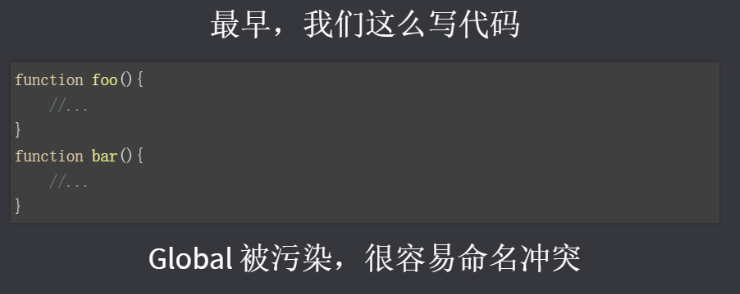
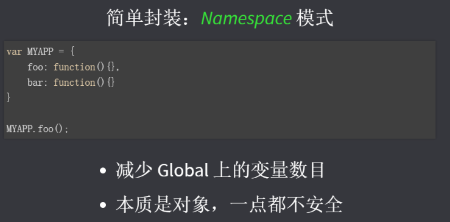
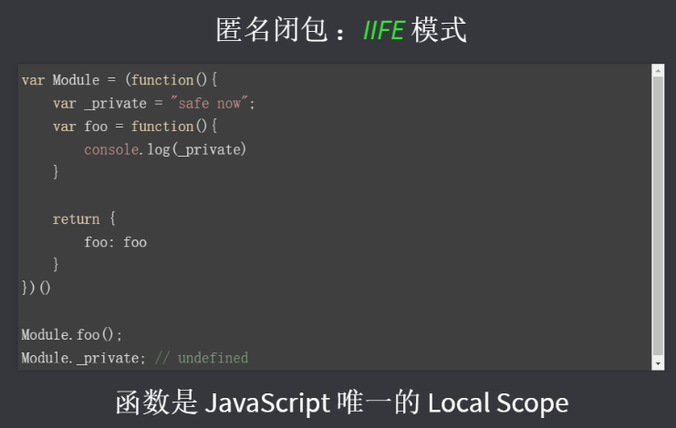
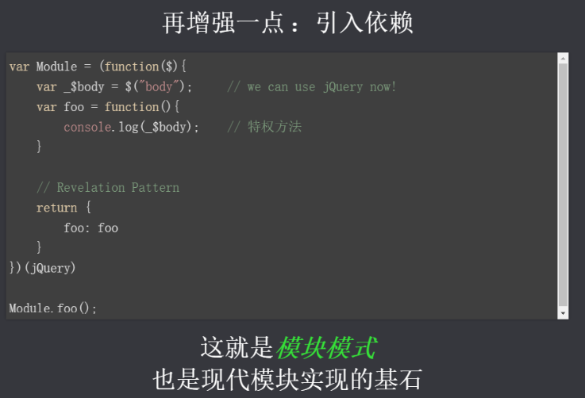
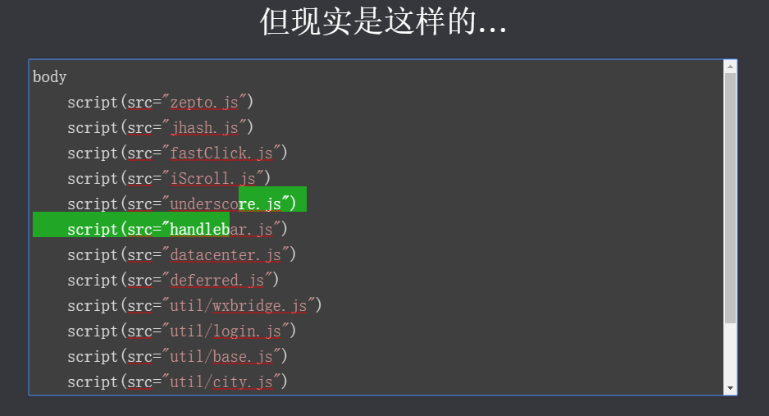
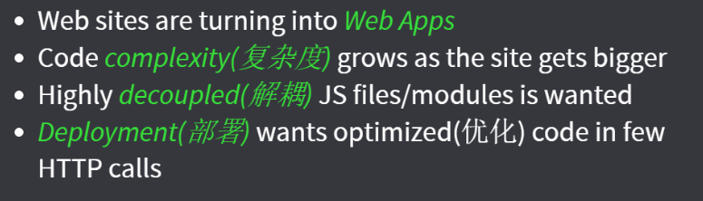

## 目录
## 模块化-js模块化
* 扩展阅读
* [理解模块化的概念及由来](#a)
    * 什么是模块／模块化？
    * 模块化的进化史
        * 全局function模式
        * namespace模式
        * IIFE模式
        * IIFE模式增强(引入依赖)
* 模块化规范
    * [CommonJS](#b)
    * [AMD:浏览器端](#c)
    * [CMD : 浏览器端](#d)
    * [ES6](#e)
* CommonJS模块化实例操作
    * [CommonJS_Node模块化教程](#f)
    * [CommonJS-Browserify模块化教程](#g)
* [AMD-RequireJS模块化实例操作](#h)
* [CMD-SeaJS模块化教程](#i)
* ES6模块化教程
    * [ES6-Babel-Browserify使用教程](#j)

 
 
 
 
 
 

## 模块化-js模块化
### 扩展阅读
* https://github.com/seajs/seajs/issues/588(前端模块化开发那点历史)
* http://zccst.iteye.com/blog/2215317(CommonJS，AMD，CMD区别)
* http://www.zhihu.com/question/20351507/answer/14859415(AMD和CMD 的区别)
* http://www.ruanyifeng.com/blog/2012/10/javascript_module.html(Javascript模块化编程)
### 
一.理解模块化的概念及由来
  
### 1.什么是模块／模块化？
* 将一个复杂的程序依据一定的规则(规范)，封装成几个块(文件)，再进行组合在一起。
* 块的内部数据/实现是内部私有的，只向外部暴露一些接口(方法)，与外部其他模块通信。
* 一个模块的组成
    * 数据--->内部的属性
    * 操作数据的行为--->内部的函数
* 模块化
    * 编码时是按照模块一个一个编码的，整个项目就是一个模块化的项目。
    
### 2.模块化的进化史

* 全局function模式:  

    编码: 全局变量／函数(将不同的功能封装成不同的全局函数)  
    问题: Global全局命名空间被污染了, 很容易引起命名冲突/数据不安全
    
    

* namespace模式  
    * 编码: 将数据/行为封装到对象中
    * 作用: 减少了全局变量(命名冲突)
    * 问题: 数据不安全(数据不是私有的, 外部可以直接修改模块内部的数据)
    
    
    
* IIFE模式
     * IIFE模式: 立即调用函数表达式---> 匿名函数自调用(闭包)
     * IIFE : immediately-invoked function expression(立即调用函数表达式)
     * 编码: 将数据和行为封装到一个函数内部，通过给window添加属性来向外暴露接口
     * 作用: 数据是私有的, 外部只能通过暴露的方法操作
     * 问题: 如果当前这个模块依赖另一个模块怎么办?
     
     
     
* IIFE模式增强

    
     * 引入依赖:通过函数形参来引入依赖模块 
     * 这就是现代模块实现的基石  
                
            (function(window, module2){
                var data = 'atguigu.com'
                function foo() {
                   module2.xxx()
                   console.log('foo()'+data)
                }
                function bar() {
                   console.log('bar()'+data)
                }
                
                window.module = {foo}
              })(window, module2)
    
* 页面引入加载script引出的问题 

     
     
    * 一个页面需要引入多个js文件
    * 请求过多:我们要依赖多个模块，那样就会发送多个请求，导致请求过多
    * 依赖模糊:不知道他们的具体依赖关系是什么,很容易因为依赖关系导致出错
    * 难以维护:以上的现象就导致了这样会很难维护。很可能出现牵一发而动全身的情况导致项目出现严重的问题
   
* 解决问题的方法
    * 这些问题可以通过现代模块化编码和项目构建来解决
    * 模块化的好处
        * 避免命名冲突(减少命名空间污染)
        * 更好的分离, 按需加载
        * 更高复用性
        * 高可维护性
        
        

### 二.模块化规范
### 
1.CommonJS
  
#### 规范：
* http://wiki.commonjs.org/wiki/Modules/1.1
* 每个文件都可当作一个模块
* 在服务器端: 模块的加载是运行时同步加载的
* 在浏览器端: 模块需要提前编译打包处理
* 基本语法: 
    * 暴露模块
        * module.exports = value
        * exports.xxx = value
        * 问题: 暴露的模块到底是什么?-------exports对象
    * 引入模块
        * require(xxx)
            * 第三方模块:xxx为模块名
            * 自定义模块: xxx为模块文件路径(不加.js)
* 实现

    * 服务器端实现
        * Node.js
        * http://nodejs.cn/
    * 浏览器端实现
        * Browserify 也称为CommonJS的浏览器端的打包工具
        * http://browserify.org/
    * 区别Node与Browserify
        * Node.js运行时动态加载模块(同步)
        * Browserify是在转译(编译)时就会加载打包(合并)require的模块
* 引入模块发生在什么时候?
    * Node : 运行时, 动态同步引入
    * Browserify : 在运行前对模块进行编译/转译/打包的处理(已经将依赖的模块包含进来了), 
                      运行的是打包生成的js, 运行时不存在需要再从远程引入依赖模块

### 
2.AMD:浏览器端
  
#### 规范

* Asynchronous Module Definition(异步模块定义)

* https://github.com/amdjs/amdjs-api/wiki/AMD
* 专门用于浏览器端, 模块的加载是异步的(可能会导致用户白屏)
* require.js
* 基本语法:
    * 定义暴露模块
            
            //定义没有依赖的模块
            define(function(){
            	return 模块
            })
            //定义有依赖的模块
            define(['module1', 'module2'], function(m1, m2){
            	return 模块
            })

    * 引入使用模块
        
            //显式声明依赖注入
            require(['module1', 'module2'], function(m1, m2){
            	使用m1/m2
            })
    * 配置: 
            
            require.config({
                      //基本路径
                      baseUrl : 'js/',
                      //标识名称与路径的映射
                      paths : {
                        '模块1' : 'modules/模块1',
                        '模块2' : 'modules/模块2',
                        'angular' : 'libs/angular',
                        'angular-messages' : 'libs/angular-messages'
                      },
                      //非AMD的模块
                      shim : {
                        'angular' : {
                            exports : 'angular'
                        },
                        'angular-messages' : {
                            exports : 'angular-messages',
                            deps : ['angular']
                        }
                      }
                    })
* 实现(浏览器端)
    * Require.js
    * http://www.requirejs.cn/
    * http://www.ruanyifeng.com/blog/2012/11/require_js.html

### 
3.CMD : 浏览器端
  

规范
*  Common Module Definition(通用模块定义)
* https://github.com/seajs/seajs/issues/242
* 专门用于浏览器端, 模块的加载是异步的 
* 模块使用时才会加载执行
* sea.js
* 基本语法:
    * 定义暴露模块
            
            //定义没有依赖的模块
            define(function(require, exports, module){
            	exports.xxx = value
            	module.exports = value
            })
            
            //定义有依赖的模块
            define(function(require, exports, module){
            	//引入依赖模块(同步)
            	var module2 = require('./module2')
            	//引入依赖模块(异步)
              	require.async('./module3', function (m3) {
                	
              	})
            	//暴露模块
            	exports.xxx = value
            })
    * 引入使用模块
            
            define(function (require) {
            	var m1 = require('./module1')
            	var m4 = require('./module4')
            	m1.show()
            	m4.show()
            })
    * 使用模块seajs.use(['模块1', '模块2'])
    
* 实现(浏览器端)
    * Sea.js
    * http://www.zhangxinxu.com/sp/seajs/
    
    
### 
4.ES6
  
规范
* ES6内置了模块化的实现
* http://es6.ruanyifeng.com/#docs/module
* 依赖模块需要编译打包处理
* 语法:
    * 导出模块: export
        
            //分多次导出模块的多个部分  
            export class Emp{  }
            export function fun(){  }
            export var person = {};
            
            //一次导出模块的多个部分
            class Emp{  }
            function fun(){  }
            var person = {};
            export {Emp, fun, person}
            
            //default导出(只能有一个)
            export default {}
            
    * 引入模块: import
    
            import defaultModule from './myModule';  //导入默认的
            import {Emp} from './myModule'; //导入指定的一个
            import {Emp, person} from './myModule'; //导入指定的多个
            import * as allFromModule from './myModule';  //导入所有
            
* 实现(浏览器端) 
     * 所有浏览器还不能直接识别ES6模块化的语法 
     * 解决
         * 使用Babel将ES6编译为ES5代码--->ES5(使用了CommonJS) ----浏览器还不能直接执行
         * 使用Browserify编译打包js---->浏览器可以运行
        
------------

## CommonJS模块化实例操作
### 
1.CommonJS_Node模块化教程
  
1. 下载安装node.js
2. 创建项目结构
      
          |-modules
            |-module1.js
            |-module2.js
            |-module3.js
          |-app.js
          |-package.json
            {
              "name": "commonJS-node",
              "version": "1.0.0"
            }
      
3. 下载第三方模块
  * npm install uniq --save
4. 模块化编码
  * module1.js
        
        module.exports = {
          foo() {
            console.log('moudle1 foo()')
          }
        }
        
  * module2.js
        
        module.exports = function () {
          console.log('module2()')
        }
        
  * module3.js
        
        exports.foo = function () {
          console.log('module3 foo()')
        }
        
        exports.bar = function () {
          console.log('module3 bar()')
        }
    
  * app.js 
        
        /**
          1. 定义暴露模块:
            module.exports = value;
            exports.xxx = value;
          2. 引入模块:
            var module = require(模块名或模块路径);
         */
        "use strict";
        //引用模块
        let module1 = require('./modules/module1')
        let module2 = require('./modules/module2')
        let module3 = require('./modules/module3')
        
        let uniq = require('uniq')
        let fs = require('fs')
        
        //使用模块
        module1.foo()
        module2()
        module3.foo()
        module3.bar()
        
        console.log(uniq([1, 3, 1, 4, 3]))
        
        fs.readFile('app.js', function (error, data) {
          console.log(data.toString())
        })
        
5. 通过node运行app.js
  * 命令: node app.js
  * 工具: 右键-->运行
  
### 
2.CommonJS-Browserify模块化教程
  
1. 创建项目结构
          
          |-js
            |-dist //打包生成文件的目录
            |-src //源码所在的目录
              |-module1.js
              |-module2.js
              |-module3.js
              |-app.js //应用主源文件
          |-index.html
          |-package.json
            {
              "name": "browserify-test",
              "version": "1.0.0"
            }
          
2. 下载browserify
  * 全局: npm install browserify -g
  * 局部: npm install browserify --save-dev
3. 定义模块代码
  * module1.js
        
        module.exports = {
          foo() {
            console.log('moudle1 foo()')
          }
        }
        
  * module2.js
        
        module.exports = function () {
          console.log('module2()')
        }
        
  * module3.js
        
        exports.foo = function () {
          console.log('module3 foo()')
        }
        
        exports.bar = function () {
          console.log('module3 bar()')
        }
    
  * app.js (应用的主js)
        
        //引用模块
        let module1 = require('./module1')
        let module2 = require('./module2')
        let module3 = require('./module3')
        
        let uniq = require('uniq')
        
        //使用模块
        module1.foo()
        module2()
        module3.foo()
        module3.bar()
        
        console.log(uniq([1, 3, 1, 4, 3]))
        
* 打包处理js:
  * browserify js/src/app.js -o js/dist/bundle.js
* 页面使用引入:
  
  `` 
  
  

## 
AMD-RequireJS模块化实例操作
  
1. 下载require.js, 并引入
  * 官网: http://www.requirejs.cn/
  * github : https://github.com/requirejs/requirejs
  * 将require.js导入项目: js/libs/require.js 
2. 创建项目结构
          
          |-js
            |-libs
              |-require.js
            |-modules
              |-alerter.js
              |-dataService.js
            |-main.js
          |-index.html
          
3. 定义require.js的模块代码
  * dataService.js
        
        define(function () {
          let msg = 'atguigu.com'
        
          function getMsg() {
            return msg.toUpperCase()
          }
        
          return {getMsg}
        })
        
  * alerter.js
        
        define(['dataService', 'jquery'], function (dataService, $) {
          let name = 'Tom2'
        
          function showMsg() {
            $('body').css('background', 'gray')
            alert(dataService.getMsg() + ', ' + name)
          }
        
          return {showMsg}
        })
        
4. 应用主(入口)js: main.js
          
          (function () {
            //配置
            require.config({
              //基本路径
              baseUrl: "js/",
              //模块标识名与模块路径映射
              paths: {
                "alerter": "modules/alerter",
                "dataService": "modules/dataService",
              }
            })
            //引入使用模块
            require( ['alerter'], function(alerter) {
              alerter.showMsg()
            })
          })()
  
        
5. 页面使用模块:  
  ``
    

6. 使用第三方基于require.js的框架(jquery)
  * 将jquery的库文件导入到项目: 
    * js/libs/jquery-1.10.1.js
  * 在main.js中配置jquery路径
    
        paths: {
                  'jquery': 'libs/jquery-1.10.1'
              }
    
  * 在alerter.js中使用jquery
        
        define(['dataService', 'jquery'], function (dataService, $) {
            var name = 'xfzhang'
            function showMsg() {
                $('body').css({background : 'red'})
                alert(name + ' '+dataService.getMsg())
            }
            return {showMsg}
        })
        

7. 使用第三方不基于require.js的框架(angular/angular-messages)
  * 将angular.js和angular-messages.js导入项目
    * js/libs/angular.js
    * js/libs/angular-messages.js
  * 在main.js中配置
        
        (function () {
          require.config({
            //基本路径
            baseUrl: "js/",
            //模块标识名与模块路径映射
            paths: {
              //第三方库
              'jquery' : 'libs/jquery-1.10.1',
              'angular' : 'libs/angular',
              'angular-messages' : 'libs/angular-messages',
              //自定义模块
              "alerter": "modules/alerter",
              "dataService": "modules/dataService"
            },
            /*
             配置不兼容AMD的模块
             exports : 指定导出的模块名
             deps  : 指定所有依赖的模块的数组
             */
            shim: {
              'angular' : {
                exports : 'angular'
              },
              'angular-messages' : {
                exports : 'angular-messages',
                deps : ['angular']
              }
            }
          })
          //引入使用模块
          require( ['alerter', 'angular', 'angular-messages'], function(alerter, angular) {
            alerter.showMsg()
            angular.module('myApp', ['ngMessages'])
            angular.bootstrap(document,["myApp"])
          })
        })()
        
  * 页面:
        
        <form name="myForm">
          用户名: <input type="text" name="username" ng-model="username" ng-required="true">
          
用户名是必须的

        </form>
    
## 
CMD-SeaJS模块化教程
  

1. 下载sea.js, 并引入
  * 官网: http://seajs.org/
  * github : https://github.com/seajs/seajs
  * 将sea.js导入项目: js/libs/sea.js 
2. 创建项目结构
          
          |-js
            |-libs
              |-sea.js
            |-modules
              |-module1.js
              |-module2.js
              |-module3.js
              |-module4.js
              |-main.js
          |-index.html
          
3. 定义sea.js的模块代码
  * module1.js
        
        define(function (require, exports, module) {
          //内部变量数据
          var data = 'atguigu.com'
          //内部函数
          function show() {
            console.log('module1 show() ' + data)
          }
        
          //向外暴露
          exports.show = show
        })
        
  * module2.js
        
        define(function (require, exports, module) {
          module.exports = {
            msg: 'I Will Back'
          }
        })
        
  * module3.js
        
        define(function (require, exports, module) {
          const API_KEY = 'abc123'
          exports.API_KEY = API_KEY
        })
        
  * module4.js
        
        define(function (require, exports, module) {
          //引入依赖模块(同步)
          var module2 = require('./module2')
        
          function show() {
            console.log('module4 show() ' + module2.msg)
          }
        
          exports.show = show
          //引入依赖模块(异步)
          require.async('./module3', function (m3) {
            console.log('异步引入依赖模块3  ' + m3.API_KEY)
          })
        })
    
  * main.js : 主(入口)模块
        
        define(function (require) {
          var m1 = require('./module1')
          var m4 = require('./module4')
          m1.show()
          m4.show()
        })
    
4. index.html:
          
          <!--
          使用seajs:
            1. 引入sea.js库
            2. 如何定义导出模块 :
              define()
              exports
              module.exports
            3. 如何依赖模块:
              require()
            4. 如何使用模块:
              seajs.use()
          -->
          
          
      
## ES6模块化教程
### 
ES6-Babel-Browserify使用教程
  
1. 定义package.json文件
      
          {
            "name" : "es6-babel-browserify",
            "version" : "1.0.0"
          }
  
2. 安装babel-cli, babel-preset-es2015和browserify
  * npm install babel-cli browserify -g
  * npm install babel-preset-es2015 --save-dev   
	(cli --- command line interface)
3. 定义.babelrc文件(默认json格式不需加后缀)
	
        {
        "presets": ["es2015"]
        }
	
4. 编码
  * js/src/module1.js
        
        export function foo() {
          console.log('module1 foo()');
        }
        export let bar = function () {
          console.log('module1 bar()');
        }
        export const DATA_ARR = [1, 3, 5, 1]
    
  * js/src/module2.js
        
        let data = 'module2 data'
        
        function fun1() {
          console.log('module2 fun1() ' + data);
        }
        
        function fun2() {
          console.log('module2 fun2() ' + data);
        }
    
    export {fun1, fun2}
    
  * js/src/module3.js
   
        export default {
          name: 'Tom',
          setName: function (name) {
            this.name = name
          }
        }
    
  * js/src/app.js
   
        import {foo, bar} from './module1'
        import {DATA_ARR} from './module1'
        import {fun1, fun2} from './module2'
        import person from './module3'
        
        import $ from 'jquery'
        
        $('body').css('background', 'red')
        
        foo()
        bar()
        console.log(DATA_ARR);
        fun1()
        fun2()
        
        person.setName('JACK')
        console.log(person.name);
    
5. 编译
  * 使用Babel将ES6编译为ES5代码(但包含CommonJS语法) : babel js/src -d js/lib
  * 使用Browserify编译js : browserify js/lib/app.js -o js/lib/bundle.js
6. 页面中引入测试
      
      ``
      
7. 引入第三方模块(jQuery)  
  1). 下载jQuery模块: 
    > npm install jquery@1 --save 
     
    2). 在app.js中引入并使用
    
        import $ from 'jquery'
        $('body').css('background', 'red')
   
    
       