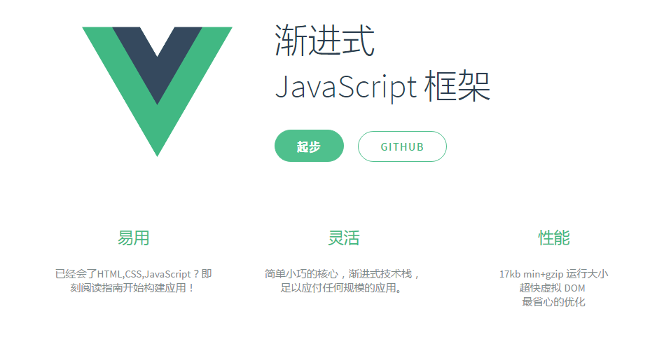

## 目录

#### [一.Vue是什么?](#a)
#### [二.如何学习Vue？](#b)
#### [三.准备工作](#c)
#### [四.对比几个常用的js库](#d)
#### 五.进一步学习Vue
* [helloVue](#e1)
* [列表](#e2)
* [事件](#e3)
* [综合练习](#e4)  
* [模版语法](#e5)
* [计算属性](#e6)
* [class 与 style 绑定](#e7)
* [条件渲染](#e8)
* [列表渲染](#e9)
* [方法与事件处理器](#e10)
* [表单控件绑定](#e11)
* [动画](#e12)
* [属性与方法](#e13)
* [vue对象的生命周期](#e14)
* 指令
    * [内置指令](#e15)
    * [自定义指令](#e16)
* [自定义插件](#e17)
        
     

## 
一.Vue是什么?

* 一位华裔前Google工程师开发的前端js库
* 一个MVVM框架
    
* 核心概念
    * 数据绑定
    * 组件
    * 虚拟DOM
* 借鉴 angular 的模板和数据绑定技术
* 借鉴 react 的组件化和虚拟 DOM 技术
* 体积小，运行效率高，编码简洁，PC/移动端开发都合适
* 它本身只关心 UI,可以轻松引入 vue 插件和其他第三方库开发项目
* Vue包含一系列的扩展插件：
    * vue-cli ---脚手架，用来创建一个模版项目
        > command line interface 命令行接口
    * vue-resource
    * vue-router ----路由，用来构建单页面应用SPA
    * vuex ---状态管理
        
## 
二.如何学习Vue？

* Vue.js官网:
    * http://cn.vuejs.org/
* 尤雨溪知乎主页: 
    * https://www.zhihu.com/people/evanyou/answers
* vue的github主页:
    * https://github.com/vuejs
* 掘金专题:
    * http://gold.xitu.io/tag/Vue.js
## 
三.准备工作

1. 安装Chrome开发插件:

    * Vue.js devtools
2. 安装Webstorm提示插件:
    * settings ==> plugin ==> browser repositories ==> 搜索vue.js ==>下载并重启
3. 将vue项目通过git进行版本控制
    * 创建远程仓库
        * github => create a new repository
    * 创建本地仓库
        * 指定git的忽略列表(可以自动生成的文件)
            * .gitignore => .idea
        * 初始化本地仓库
            * terminal => git init => git add * => git commit -m "init vue test app"
                * 代码添加到本地仓库中(版本区)
            * git remote add origin + 远程仓库路径url
                * 关联到远程 
            * git push origin master
                > master -> 从本地 master 分支推送到远程 master 分支
## 
四.对比几个常用的js库

> jQuery,zepto,angular,react,vue  
        
* jQuery,zepto 
    * 称为函数库，是对DOM(还有ajax)的封装
    * 直接操作DOM从而更新DOM更新页面
* angular,react,vue  
    * 称为结构化框架，MVVM,用于在浏览器端动态构建页面，并与用户交互
    * angular(先于react出现) 有模版(包含js代码的html，表达式，指令，)，双向数据绑定等概念
        * model <=> view 
        * model => view 更新页面
    * 数据驱动DOM，直接操作数据，实现页面变化，不会直接操作DOM(这部分工作被隐藏)
        * 组件化
            * 功能组件，方便复用，便于维护
        * 虚拟DOM
            * 快，页面更快展现，更快更新
            * 一个一般的对象，与一个真实的DOM元素相对应，我们操作的是虚拟DOM，通过虚拟DOM来批量的操作真实DOM
            * React 会通过 DOMdiff 算法，高效的区别哪些虚拟DOM发生了变化，把虚拟DOM的变化同步到真实DOM中去(最小化页面重绘)  
    * Vue
        * 借鉴 angular 的模板和数据绑定技术
        * 借鉴 react 的组件化和虚拟 DOM 技术
        * 体积小，运行效率高，编码简洁，PC/移动端开发都合适
## 五.进一步学习Vue
 > 声明式渲：Vue.js的核心是允许采用简洁的模版语法来声明式的将数据渲染进DOM
* 下载vue开发版本／cdn引入／NPM模块化开发
1. 
helloVue

    1. 引入Vue.js
    2. 创建Vue对象
        * el : 指定根element(选择器)
        * data : 初始化数据(页面可以访问)
    3. 双向数据绑定 : v-model
    4. 显示数据 : {{xxx}}
    5. 理解vue的mvvm实现
        > 注意: 需要在webstorm中安装vue.js插件
            
            

                <input type="text" v-model="msg">
                
{{msg}}

            

            
            
            
2. 
列表

    1. 在data中初始数组数据
    2. 在页面中遍历显示: v-for
    3. 练习：显示信息列表
    
                <ul id="test">
                  <li v-for="(todo,index) in todos">{{index+1}}--{{todo.id+'~~'+todo.name}}</li>
                </ul>
                
                
        
3. 
事件

    1. 绑定监听的指令:  
        * v-on:xxx="函数名或函数调用"
        * @xxx="函数名或函数调用"
    2. 定义事件处理的函数:
    
                methods : {
                  函数名 : function( ){...}
                }
    3. 练习：倒序排列字符串
            
                
<!--就是mvvm中的view-->
                  
{{msg}}

                  <!--<button v-on:click="reverse">倒序</button>-->
                  <button @click="reverse">倒序</button>
                

                
                
                
4. 
综合练习：
  

    * 综合使用以下技术:  
        1. 页面指令:  
            v-model  
            @click  
            @keyup.enter  
            v-for / $index  
            v-text  
        2. Vue对象  
            初始化数据: data  
            事件处理函数: methods  
    * 功能，动态添加删除todoList
    
            

              <input type="text" v-model="inputTodo" @keyup.enter="addTodo">
              <ul>
                <li v-for="(todo, index) in todos">
                  {{todo.name}}
                  <button @click="removeTodo(index)">X</button>
                </li>
              </ul>
            

            
            
            
5. 
模版语法

    1. 表达式 :  
        * 语法: {{exp}} 或 {{{exp}}}  
        * 功能: 向页面输出数据  
        * 可以调用对象的方法     
    2. 强制数据绑定:
        * 适用场景:
            * 标签内部是动态数据，但标签属性为html内置的属性而不是指令的时候，动态数据会当作字符串解析，这个时候需要强制数据绑定
        * 完整写法:  
        
                 v-bind:xxx='yyy'  //yyy会作为表达式解析执行  
        * 简洁写法:  
        
                  :xxx='yyy'  
    3. 事件监听:  
        * 完整写法:  
        
                v-on:keyup='xxx'  
                v-on:keyup='xxx(参数)'  
                v-on:keyup.enter='xxx'  
        * 简洁写法: 
        
                @keyup='xxx'
                @keyup.enter='xxx'
    4. 实例应用：
            
                

                <h2>1. 表达式</h2>
                    {{msg}} 
                    {{msg.toUpperCase()}}
                <h2>2. 强制数据绑定:</h2>
                     <a v-bind:href="url">尚硅谷</a>
                     <a :href="url">尚硅谷</a>
                <h2>3. 事件监听:</h2>
                    <input type="text" @keyup.enter="test1">
                    <input type="text" @keyup.enter="test2($event)">
                

                
                
                
6. 
计算属性

    * 计算属性
        * 在computed属性对象中定义计算属性的方法
        * 在页面中使用{{方法名}}来显示计算的结果
    * 监视属性:
        * 通过vm对象的$watch()或watch配置来监视指定的属性
        * 当属性变化时, 回调函数自动调用, 在函数内部进行计算
    * 计算属性高级:
        * 通过get/set方法实现对属性数据的显示和监视
        * 计算属性存在缓存, 多次读取只执行一次
    * 实例应用：     
            

              姓: <input type="text" placeholder="First Name" v-model="firstName" > 
              名: <input type="text" placeholder="Last Name" v-model="lastName"> 
              姓名1(单向): <input type="text" placeholder="Full Name" v-model="fullName"> 
              姓名2(单向): <input type="text" placeholder="Full Name" v-model="fullName2"> 
              姓名3(双向): <input type="text" placeholder="Full Name2" v-model="fullName3"> 
            

            
            

              姓: <input type="text" placeholder="First Name" v-model="firstName" > 
              名: <input type="text" placeholder="Last Name" v-model="lastName"> 
              姓名1(单向): <input type="text" placeholder="Full Name" v-model="fullName"> 
              姓名2(单向): <input type="text" placeholder="Full Name" v-model="fullName2"> 
              姓名3(双向): <input type="text" placeholder="Full Name2" v-model="fullName3"> 
            

            
            
            
7.  绑定
class 与 style

    * 动态绑定class  
        * :class="a" a是一个data属性
        * :class="{ 'class-a': isA, 'class-b': isB }"   其中isA/isB是布尔型data属性
        * :class="[classA, classB]" 其中classA/classB是字符串值
    * 动态绑定style
        * :style="{ color: activeColor, fontSize: fontSize + 'px' }"  其中activeColor/fontSize是data属性
    * 实例应用:
        
                

                      
测试v-bind:class 变量语法

                      
测试v-bind:class 对象语法

                      
测试v-bind:class 数组语法

                    
                      
测试v-bind:style

                

                
                
                
8. 
条件渲染

    * 切换一个元素:
        * v-if  ---- 移除元素
        * v-else ---- 隐藏元素
        * v-show
    * 切换多个元素
        * `<template v-if="ok">`  //不能用v-show 不会生成dom元素
        
    * 注意: 如果需要频繁切换 v-show 较好，如果在运行时条件不大可能改变 v-if 较好
    * 实例应用：
            
                

                    <h1>测试: 切换一个元素</h1>
                    
我喜欢你

                    
你喜欢我

                    
来自星星的你

                
                    <h1>测试: 切换多个元素</h1>
                    <template v-if="ok">
                        <h2>xxxx</h2>
                        <h2>yyyy</h2>
                        <h2>zzzzz</h2>
                    </template>
                    <button @click="ok=!ok">切换</button>
                

                
                
                
9. 
列表渲染

    * 遍历显示数组 : v-for / index
        * 注意:filter过滤数组后对index的影响
        * 实例应用: 动态显示人物信息，实现删除和更新功能
                
                <ul>
                    <li v-for="(p, index) in filterPersons">
                      {{index}}--{{p.name}}--{{p.age}}
                      --<button @click="removeP(p)">删除</button>
                      --<button @click="updateP(p, {name:'Cot', age:18})">更新</button>
                    </li>
                </ul>
                
                new Vue({
                    el : '#demo',
                    data : {
                      persons: [
                        {name: 'Tom', age: 12},
                        {name: 'Jack', age: 15},
                        {name: 'Bob', age: 14}
                      ]
                    },
                
                    methods: {
                      removeP (p) {
                        // 得到元素在数组中下标
                        var index = this.persons.indexOf(p)
                        // 删除
                        this.persons.splice(index, 1)
                      },
                      updateP (oldP,newP) {
                        // 得到元素在数组中下标
                        var index = this.persons.indexOf(oldP)
                        console.log(index)
                        // 更新下标所对应的数组元素
                        // this.persons[index] = newP
                        this.persons.splice(index, 1, newP)
                      }
                    },
                
                    computed: {
                      filterPersons () {
                        // 哪些数组元素会放入返回的数组中? 只有回调函数返回值为true的p
                        return this.persons.filter(p => p.name.indexOf('o')>=0)
                      }
                    }
                  })
                
    * 遍历显示对象 : v-for / key 
        * 遍历显示对象的属性名，属性值
                
                    <ul>
                        <li v-for="(value, key) in persons[1]">
                            {{key}}----{{value}}
                        </li>
                    </ul>
10. 
方法与事件处理器

    * 绑定监听:  
        * v-on:xxx="fun"  
        * @xxx="fun"  
        * @xxx="fun(参数)"  
        * 默认事件形参: event  
        * 隐含属性对象: $event  
        * 实例应用:
          
                      <h2>1. 绑定监听</h2>
                      <button v-on:click="test1">测试1</button>
                      <button @click="test1">测试2</button>
                      <button @click="test2('abc', $event)">测试3</button>
                      
                      new Vue({
                          el: '#example',
                          methods: {
                              test1(event){
                                  alert(event.clientY);
                              },
                              test2(msg,event){
                                  alert(msg+'-----'+event.clientY);
                              }
                          }
                      })
    * 事件修饰符:
        * .prevent : 阻止事件的默认行为 event.preventDefault()
                
                

                    

                

                
        * .stop : 停止事件冒泡 event.stopPropagation()    
                
                <a href="http://atguigu.com" @click.prevent="test3">尚硅谷</a>
    * 按键修饰符
        * .keycode : 操作的是某个keycode值的健(具体keycode可以百度查询)
        * .enter : 操作的是enter键
        
                <input type="text" @keyup.enter="test6">
                <input type="text" @keyup.65="test6">

                test6(event){
                    alert(event.keyCode + event.target.value)
                }
11. 
表单控件绑定

    * 使用v-model对表单项数据双向绑定
        * text/textarea
        
                

                  <input type="text" v-model="msg">
                  <textarea name="" id="" cols="30" rows="10" v-model="msg"></textarea>
                    {{msg}}
                

                new Vue({
                    el:'#demo',
                    data:{
                        msg:'tangtang'
                    }
                })
        * checkbox : 绑定boolean/string值
                
                <input type="checkbox" name='students' value='Tom' v-model="selectStudent">Tom
                <input type="checkbox" name='students' value='Bom' v-model="selectStudent">Bom
                <input type="checkbox" name='students' value='Dom' v-model="selectStudent">Dom
                {{selectStudent}}
                
                new Vue({
                    el:'#demo',
                    data:{
                        selectStudent:['Bom']//默认选中Bom
                    }
                })
        * radio
                
                <input type="radio" name='sex' value="female" v-model="sex">女
                <input type="radio" name='sex' value="male" v-model="sex">男
                {{sex}}
                
                new Vue({
                    el:'#demo',
                    data:{
                        sex:'male'
                    }
                })
        * select
                
                <select name="city" v-model="selectCityId">
                    <option :value="city.id" v-for="city in citys">{{city.name}}</option>
                </select>
                {{selectCityId}}
                
                new Vue({
                    el:'#demo',
                    data:{
                        citys: [
                            {id: 1, name: 'BJ'},
                            {id: 3, name: 'SZ'},
                            {id: 5, name: 'SH'}
                        ],
                        selectCityId:5
                    }
                })
                
    * 失去焦点才更新: .lazy
            
            <input type="text" placeholder="失去焦点才更新" v-model.lazy="msg2">{{msg2}}
    * 自动去除两端空格: .trim
            
            <input type="text" placeholder="自动trim" v-model.trim="msg3">---{{msg3}}---
        
12. 
动画

    * fade-enter-active: 进入的过程, 指定进入的transition
    * fade-leave-active: 离开的过程, 指定离开的transition
    * fade-enter: 进入前的状态: 指定隐藏时的样式
    * fade-leave-to: 离开后的状态: 指定隐藏时的样式
    * 实例应用1：点击按钮切换文字的显示隐藏过渡动画
    
            
            
            

                <button @click="isShow=!isShow">切换</button>
                <transition name="fade">
                  
hello

                </transition>
            

              
            
            
    * 实例应用2:点击按钮切换文字的显示隐藏与位移的过渡动画
            
            .fade-enter-active { /*进入的transition*/
                  transition: all 2s linear;
                }
                .fade-leave-active { /*离开的transition*/
                  transition: all .5s cubic-bezier(1.0, 0.5, 0.8, 1.0);
                }
                .fade-enter, .fade-leave-to {
                  opacity: 0;
                  transform: translateX(50px);
                }
              </style>
              
              

                <button @click="isShow=!isShow">切换</button>
                <transition name="fade">
                  
hello

                </transition>
              

              
              
              
    * 实例应用3: 点击按钮文字大小变化显示隐藏
            
            
            
            
            
13. 
属性与方法

    * 每个vue实例都会代理其 data 对象里的所有属性
     
             var vm = new Vue({
                el:'',
                data:{
                    a:msg
                }
             })
             vm.a=.....
             
14. 
vue对象的生命周期

    
    
    * 初始化显示
        * new vue()
        * beforeCreate()
        * created() : 在此启动异步任务(ajax请求, 定时器)
        * beforeCompiled()
        * compiled()//compiled编译
        * beforeMount()
        * mounted()
    * 更新
        * beforeUpdate()
        * updated()
    * 销毁vue实例: vm.$destory()
        * beforeDestory(): 在此做一些收尾的工作: 如清理定时器
        * destoryed()
    * 实例应用
            
                

                    <button @click="kill">stop</button>
                    
{{msg}}

                    

                

                
                
                
                //注意：组件destroy之前要关闭定时器。灵活运用this，关闭定时器
15. 指令
* 
内置指令

    * v:text : 更新元素的 textContent
    * v-html : 更新元素的 innerHTML
    * v-if : 如果为true, 当前标签才会输出到页面
    * v-else: 如果为false, 当前标签才会输出到页面
    * v-show : 通过控制display样式来控制显示/隐藏
    * v-for : 遍历数组/对象
    * v-on : 绑定事件监听, 一般简写为@
    * v-bind : 强制绑定解析表达式, 可以省略v-bind
    * v-model : 双向数据绑定
    * ref : 为某个元素注册一个唯一标识, vue对象通过$refs属性访问这个元素对象
    * v-cloak : 使用它防止闪现表达式, 与css配合: [v-cloak] { display: none }
    * 实例应用：
            
                

                  

                  

                  
                  
tangtang

                  <button @click="click">点我一下</button>
                

                
                
* 
自定义指令

    1. 注册全局指令
    
                Vue.directive('upper-text', function(el, binding){
                  el.innerHTML = binding.value.toupperCase();
                })
    2. 注册局部指令 ---> 只针对某一个vm对象
    
                directives : {
                  'lower-text' : {
                      bind (el, binding) {
                        el.innerHTML = binding.value.toLowerCase()
                      }
                  }
                }
    3. 使用指令:
                
                v-my-directive='xxx'
    4. 实例应用:
        * 配置全局指令，使输入框自动获取焦点
        * 配置全局指令，使字母大写输出
        * 配置局部指令，使字母小写输出
                
                    

                      <input type="text" v-focus>
                      

                      

 //test中无法获取到test2的局部指令
                    

                    
                    

                      

                      

                    

                    
                    
                    
16. 
自定义插件

* 插件模块：

           (function (window) {
             var MyPlugin = {}
             MyPlugin.install = function (Vue, options) {
               // 1. 添加全局方法或属性
               Vue.myGlobalMethod = function () {
                 console.log('myGlobalMethod()')
               }
               // 2. 添加全局资源
               Vue.directive('my-directive', {
                 bind (el, binding, vnode, oldVnode) {
                   el.innerHTML = 'my-directive: '+binding.value
                 }
               })
               // 4. 添加实例方法
               Vue.prototype.$myMethod = function (options) {
                 console.log('Vue实例对象方法 $myMethod()')
               }
             }
           
             window.MyPlugin = MyPlugin
           })(window)
* 使用插件：
                
            

              

            

            
            
            
            