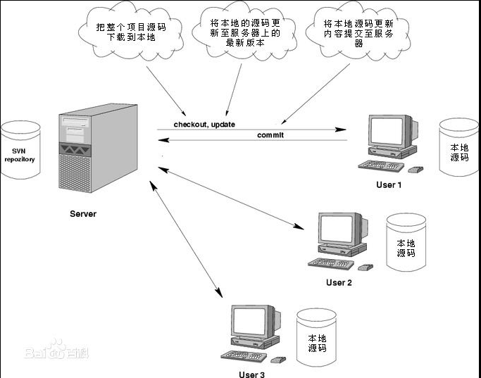
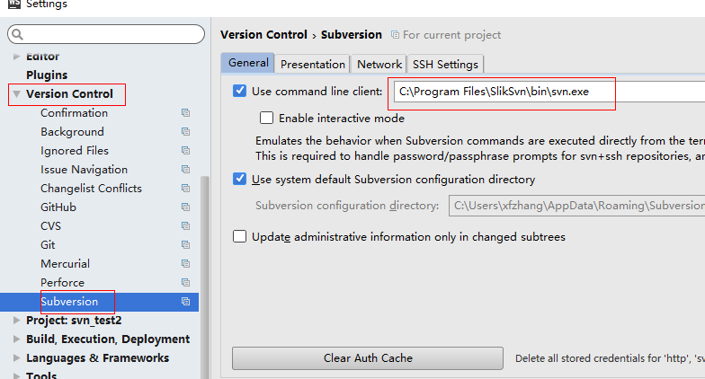
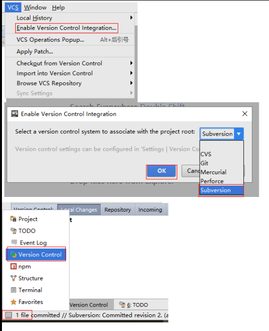

## 目录
#### SVN
* [概述](#a)
* [基本工作流程](#b)
* [基本工作模型](#c)
* [状态说明](#d)
* [分支](#e)
* [WebStorm集成SVN](#f)
* 附件：
    1. [服务器 安装文件](./attachment/VisualSVN-Server-2.7.1.msi)
    2. [客户端 安装文件](./attachment/TortoiseSVN-1.9.4.27285-x64-svn-1.9.4.msi)
    3. [webStorm集成配置](./attachment/Slik-Subversion-1.9.4-x64.msi)
    4. [软件安装使用示意图](./attachment/软件安装使用示意图.docx)

## SVN
#### 
一. 概述

1. SVN是Subversion的简称
2. 用于多个人共同开发同一个项目
3. 客户端服务器模式
#### 
二. 基本工作流程

1. 基本流程
    1. 早上来到公司
    2. 从服务器下载项目组最新代码
    3. 在自己的机器上工作
    4. 每隔2小时提交一次代码
    5. 离开公司前确保今天的代码全部上传到服务器
2. 注意事项
    * 开始写代码前一定要更新
3. SVN常用命令
    * checkout: 从服务器第一次获得代码
    * commit: 向服务器提交代码
    * update: 开始工作前，从服务器获得最新的代码
    * merge: 将多个文件中的代码合并到同一个文件
    * truck: 主干，打包从主干打包
    * branches: 分支，开发新功能，修改bug
    * tags: 里程碑，保存某个重要版本的代码
#### 
三. 基本工作模型

1. 第一次下载代码 
    * checkout
2. 更新代码
    * update 从服务器获取最新代码
3. 提交代码
    * commit 把本地仓库的代码提交到服务器
4. 查看历史版本和回退到历史版本
    * show log
    * revert
5. 冲突的产生与解决
    * 冲突产生的原因
        * 多人编辑同一个文件的同一行
        * 本地代码和服务器代码冲突
    * 示例
        * 多国语言网站
        * 多人同时开发
    * 解决冲突的方法
        * 使用工具
            * 小乌龟   edit conflict
                * 保证编辑好的结果是最终想要的结果
                * 保存文件
                * 标记 为 已经解决冲突
                * commit 到服务器
        * 使用代码
            * 手动打开文件
            * 手动编辑代码
            * 达到目标状态 保存文件
            * 手动 标记为 已经解决状态
            * commit 上传服务器
6. 使用忽略列表
    * 原因
        * 服务器代码库中的文件应该是所有程序员都有用的
        * 有些文件不需要上传到服务器代码库
            * webstorm 自动生成的 .idea 文件
            * node_modules 文件夹
            * 用来做测试的文件
#### 
四. 状态说明

* 基本状态说明
    *  新建的文件
    *  已本地管理, 但还没提交到服务器
    *  已提交同步到服务器
    *  本地文件修改了, 但还没有提交
    *  要提交的文件与服务器端的有冲突
    *  当前文件被设置了锁定, 但当前用户没有获得锁, 不能操作
    *  当前文件被设置了锁定, 但当前用户获得了锁, 可以操作了
#### 
五. 分支

1. 3个基本概念
    * 主干 trunk
        * 保持代码处于可以发布产品的状态
    * 分支 branch
        * 修改bug
        * 开发新功能
    * 标签 tag
        * 某个里程碑的完整状态
2. 2个基本动作
    * 开分支
        * 从主干上开分支
        * 作用：
            * 修改bug --- 修改完成后 merge 回主干
            * 开发新功能 --- 开发完成后 merger 回主干
    * 合并分支
        * 把分支合并回主干上
3. 示例
    * app 开发
#### 
六. WebStorm集成SVN

1. 安装svn的命令行工具Slik-Subversion-1.9.4-x64
2. 配置指定slik  

3. 将应用与SVN关联  
