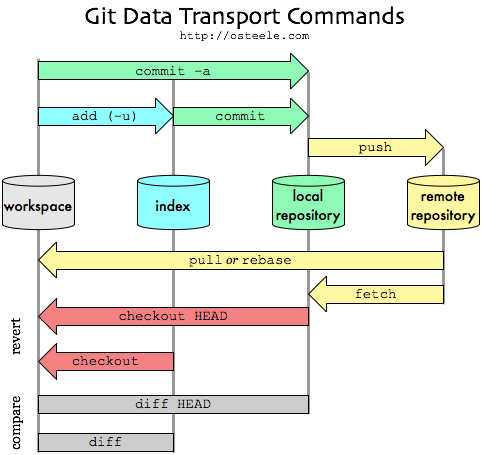

## 目录

#### Git
* [Git与GitHub](#a)
* [搭建环境](#b)
* [系统组成](#c)
* [常用操作](#d)
    1. [创建仓库](#d1)
    2. [本地仓库和远程仓库相关联](#d2)
    3. [提交本地仓库](#d3)
    4. [查看状态](#d4)
    5. [分支](#d5)
    6. [更新与合并](#d6)
    7. [冲突解决](#d7)
    8. [推送远程仓库](#d8)
    9. [同步远程仓库](#d9)
    10. [查看 log](#d10)
    11. [标签(备份重要版本)](#d11)
    12. [替换工作区中的内容](#d12)
    13. [忽略列表](#d13)
    14. [git fetch 与 git pull 的比较](#d14)

* [git/gitHub 的基本模型](#e)
    * 本地仓库
    * 远程仓库

     

## Git
#### 
一.Git与GitHub

1. 区别
    * Git: 版本控制工具
    * GitHub: 网站／远程仓库／社交平台
        * 远程仓库：
            * 免费：必须开源
            * 收费：可以闭源
2. 联系
    * 程序员电脑的git仓库向GitHub的仓库提交代码
#### 
二.搭建环境

1. 远程仓库
    * 公司自己建立私有仓库
    * 使用GitHub: https://github.com
2. 本地仓库
    * [msysgit(命令行)](./attachment/msysgit安装.doc)
    * [TortoiseGit(可视化)](./attachment/TortoiseGit.doc)
#### 
三.系统组成

1. 本地仓库
    * git
2. 远程仓库
    * gitHub
#### 
四.常用操作

1. 
创建仓库

    * 创建远程仓库
        * 注册 github 账号
        * 在线创建仓库
    * 创建本地仓库
        * 克隆远程仓库到本地
            * git clone 远程仓库的地址(git@github.com:baihaojie/0728.git)【注意是 ssh 的地址】
        * 新生成本地仓库
            * git init : 创建新的git仓库(会生成.git文件夹)
2. 
本地仓库和远程仓库相关联

    * 由于你的本地Git仓库和GitHub仓库之间的传输是通过SSH加密的，所以，需要一点设置：
        1. 创建SSH Key 
            * 在用户主目录下，看看有没有.ssh目录，如果有，再看看这个目录下有没有idrsa和idrsa.pub这两个文件，如果已经有了，可直接跳到下一步。
            * 如果没有，打开Shell（Windows下打开Git Bash），创建SSH Key： `$ ssh-keygen -t rsa -C "youremail@example.com"` 你需要把邮件地址换成你自己的邮件地址，然后一路回车，使用默认值即可。
            * 在用户主目录里找到.ssh目录，里面有idrsa和idrsa.pub两个文件，这两个就是SSH Key的秘钥对，idrsa是私钥，不能泄露出去，idrsa.pub是公钥，可以放心地告诉任何人。
        2. 登陆GitHub，打开“settings”，“SSH Keys”页面： 然后，点“Add SSH Key”，填上任意Title，在Key文本框里粘贴id_rsa.pub文件的内容,添加完成.
        3. 当前的 ssh key 的使用状态是未使用，我们可以通过 pull 命令专门要一次数据来实现激活。在第一次要数据的时候，系统会提示我们是否同意，我们输入 yes 表示同意即可。
        4. 测试是否配置成功 `-ssh -T git@github.com`
        5. 测试上传文件是否成功
        6. 注意：远程仓库必须是使用 ssh 关联方式才能生效， 如果是 https 的方式就不会生效
            * 断开关联
                * `git remote remove origin`
            * 建立关联
                * `git remote add origin "项目的ssh地址"`
3. 
提交本地仓库

    * git add * 
        * 将工作区的新增/修改提交到暂存区: 
    * git commit -m '代码提交信息'
        * 将暂存区的更新提交到版本区(HEAD)
4. 
查看状态

    * git status
5. 
分支

    * 查看所有分支
        * git branch
    * 创建一个叫做“featurex”的分支，并切换过去
        * git checkout -b feature_x
    * 创建新文件(x.txt),并添加提交: 
        * git add * --->git commit -m "new x file"
    * 切换回主分支 
        * git checkout master
    * 推送到远程仓库: 
        * git push origin feature_x
    * 删掉新建的分支
        * git branch -D feature_x
6. 
更新与合并

    * 将远程最新版本拉到本地: 
        * git pull origin master
    * 比较2个分支版本的区别:
        * git diff
    * 合并分支
        * git merge
    * 在更新或合并时可能会出现冲突, 解决冲突
7. 
冲突解决

    * 打开文件修改文件内容
    * git add *
    * git commit -m "resolve conflict"
8. 
推送远程仓库

    * 如果不是克隆的仓库, 第一次需要先关联上远程仓库: 
        * `git remote add origin url(远程仓库的地址)`
    * 推送之前先同步代码，将远程最新版本拉到本地: 
        * `git pull origin master`
    * 将本地版本区的更新推送到远程仓库:
        * `git push origin master`
        * 提示输入 username
        * 提示输入 password
9. 
同步远程仓库

    * git pull origin master
    * git fetch origin master
10. 
查看 log

    * git log
    * git reflog
11. 
标签(备份重要版本)

    * 查看提交日志 : 
        * git log (按Q退出)
    * 记录每一次命令: 
        * git reflog
    * 给重要版本创建标签: 
        * git tag 1.0.0 1b2e1d63ff(某个提交ID)
    * git tag
    * 将工作区切换到标签版本: 
        * git checkout 1.0.0
    
12. 
替换工作区中的内容

    * 回到未来： 
        * git reset --hard 1b2e1d63ff(某个提交ID)
    * 使用HEAD中的最新内容替换掉你的工作目录中的文件 : 
        * git checkout -- <fileName>
    * 取得远程的代码，但是不合并： 
        * git fetch origin master
    * 丢弃你在本地的所有改动与提交 : 
        * git fetch origin --> git reset --hard origin/master
13. 
忽略列表

    > .gitignore 配置文件用于配置不需要加入版本管理的文件，配置好该文件可以为我们的版本管理带来很大的便利
    * 添加忽略的配置文件.gitignore
    * 通过vim .gitignore来创建文件
    * 匹配规则:
        * 以斜杠 “ / ” 开头表示目录；
        * 以星号 “ * ” 通配多个字符；
        * 以问号 “ ? ” 通配单个字符
        * 以方括号 “ [ ] ” 包含单个字符的匹配列表；
        * 以叹号 “ ! ” 表示不忽略(跟踪)匹配到的文件或目录；
    * git 对于 .gitignore 配置文件是按行从上到下进行规则匹配的，意味着如果前面的规则匹配的范围更大，则后面的规则将不会生效
    * 示例：
    * 规则：
                
                fd1/*
        * 说明：忽略目录 fd1 下的全部内容；注意，不管是根目录下的 /fd1/ 目录，还是某个子目录 /child/fd1/ 目录，都会被忽略；
    
    * 规则：       
                
                /fd1/*
        * 说明：忽略根目录下的 /fd1/ 目录的全部内容；
    
    * 规则：
    
                /*
                !.gitignore
                !/fw/bin/
                !/fw/sf/
    
        * 说明：忽略全部内容，但是不忽略 .gitignore 文件、根目录下的 /fw/bin/ 和 /fw/sf/ 目录；

14. 
git fetch 与 git pull 的比较

    
    * pull = fetch + merge
#### 

五.git与gitHub 的基本模型
1. 本地仓库  

    
    * 工作流: 你的本地仓库由 git 维护的三棵“树”组成
        * 第1个: 工作区(working dir) 你的工作目录
        * 第2个: 暂存区（Index/Stage）它像个缓存区域，临时保存你的改动
        * 第3个: 版本区(HEAD), 它指向你最后一次提交的结果
2. 远程仓库
    
    